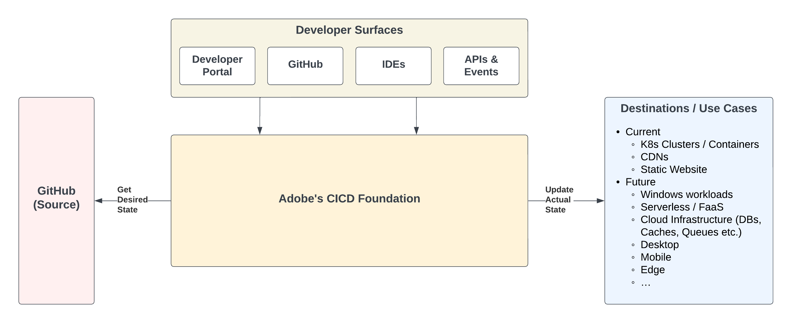
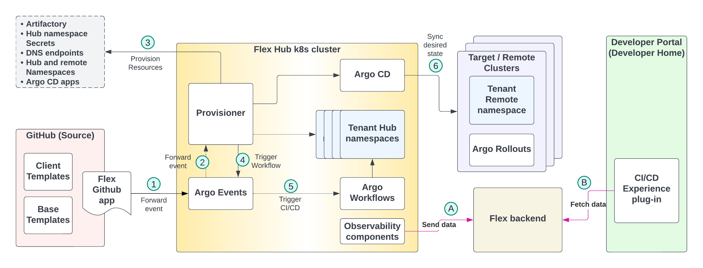
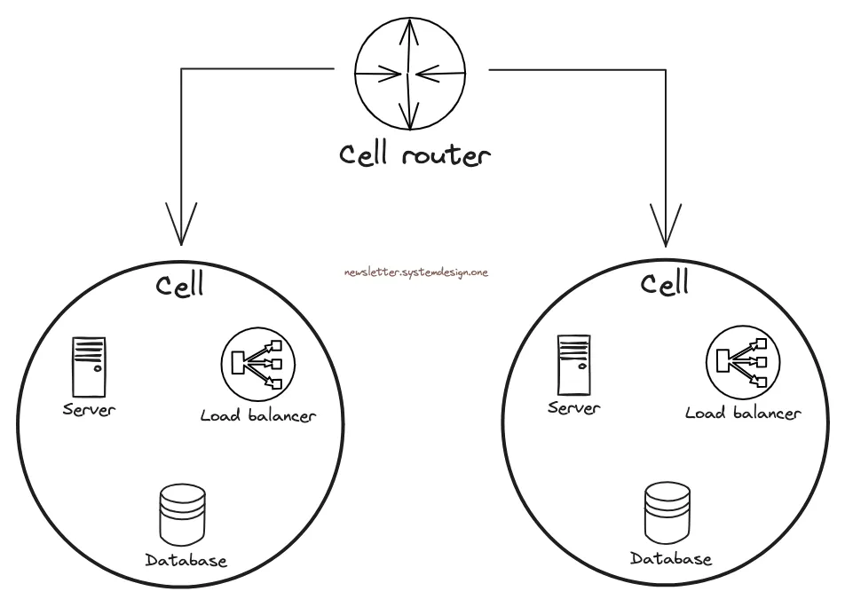
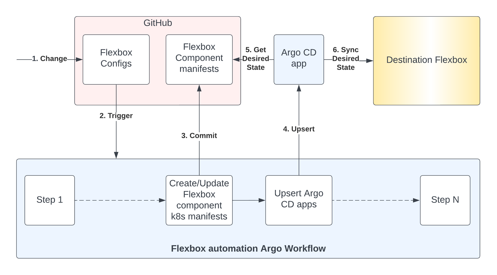

## Relevant CNCF projects


  
  
  - **Using since:** 2019
  - **Current version:** 1.29.6  

  Kubernetes has been the foundation for our Internal Developer Platform and almost all of Adobe's containerized workloads run on Kubernetes clusters.
  

  
  
  - **Using since:** 2019  
  - **Current version:** v3.12.3 

  Helm is our package manager and helps us abstract out some of the complexity by including them as dependencies and only exposing the values.yaml file.
  

  
  
  - **Using since:** 2022  

  We are using all four projects under Argo:
  - Argo CD: v2.9.22
  - Argo Workflow: v3.4.6
  - Argo Events: v1.9.0
  - Argo Rollouts v1.6.0
  

  
  
  - **Using since:** 2023  
  - **Current version:** TBD

  Backstage is the backbone for our unified internal developer portal.
  


## Developer Platforms @ Adobe
Adobe has been working on building an Internal Developer Platform (IDP) for the past several years. We have a core infrastructure layer which offers a compute layer on top of cloud providers such as AWS and Azure. On top of the infrastructure layer, we provide an end-to-end developer experience which helps developers in different phases of SDLC.

Security, Compliance, Support and Cost Efficiency are cross-cutting concerns for both infrastructure and developer experience.

### Developer Experience / Flex @ Adobe
Adobe offers a rich developer experience to its developers to enable them to write better software faster. This includes a seamless experience for all phases of their application lifecycle: Concept → Code → Cloud → Customer. **Flex** is the codename for Adobe’s **GitOps**-based Service Delivery foundation.

- **Concept → Code**: Adobe offers standardized **bootstrappable golden templates** via the unified developer portal (based on [Backstage](https://backstage.io/)), which provides a guided path that generates boilerplate code (with best practices built-in) for the app and infrastructure.
  - The promise is that you should be able to run and test the app locally right after code generation.
  - The generated infrastructure includes, among other things, the manifests for the service’s CI/CD pipeline.
  - *Toolchain* - The developer portal is based on the industry-standard open-source tool Backstage.
- **Code → Cloud**: Adobe offers customizable and flexible GitOps-based CI/CD pipelines (based on Argo projects) to developers.
  - The developers start with a paved path but Flex allows users to customize their CI/CD pipeline if needed, including adding new steps or changing the pipeline DAG.
  - The CI/CD pipeline does just-in-time provisioning during deployments i.e. it provisions necessary resources to make deployments successful. For example, DNS endpoints, K8s namespaces, Argo CD apps etc.
  - Advanced deployment strategies like Canary, Blue-Green etc. are supported out of the box.
  - *Toolchain* - We use industry-standard open-source Argo projects: Argo CD, Argo Workflows, Argo Events, and Argo Rollouts.
- **Cloud → Customer**: Adobe offers a “Single pane of glass” developer experience (called Flexperience) in the developer portal for managing the application.
  - *Toolchain* - The experience is provided as a Backstage plug-in in the developer portal.
- **Control Plane** – The control plane for the service delivery workflow is based on AWS EKS clusters.

Flex has had rapid organic growth in the last 2 years since its launch. Here are some numbers that represent the scale that we are handling (as of Oct 2024): 
- $>$ 360 remote K8s clusters
- $>$ 22K Argo CD apps
- $>$ 30K deployments per month
- $>$ 1K services in production

And these numbers are increasing by the day.

In this article, we will cover Flex’s initial architecture, its challenges, and the need for a re-architecture. Then, we will deep-dive into our new Flex-in-a-box architecture, including the architecture requirements and an introduction to cell-based architecture. We’ll conclude by discussing the benefits, challenges, use cases, and future ideas.

## Initial Architecture
Here is a simplified high-level diagram describing how Flex acts as the foundation between the source (Github), destinations, and the developer surfaces.

As you can see in the diagram, the CI/CD foundation acts as the glue between the source and the destinations. The developer surfaces, powered by the foundation, offer paved roads and seamless workflows for various use cases.

Here is the initial architecture that we started with.

We have a Hub-and-Spoke architecture with the Hub in the middle (aka Flex Hub k8s cluster) connected to the various remote K8s clusters, which act as the spokes. As you can see, we have Git as the source of truth on the left, and K8s clusters as the remote clusters (destinations) on the right.

We use Argo Workflows for creating the CI/CD pipeline, Argo CD for providing GitOps capabilities, and Argo Events for catching events and triggering workflows. The CI/CD pipeline runs on the Hub cluster in a per-service namespace. Argo Rollouts is installed on remote K8s clusters and provides advanced deployment capabilities with Argo CD. The service runtime runs on namespaces provisioner on these remote K8s clusters.

Provisioner is a homegrown component that does the just-in-time provisioning during deployments. A couple of home-grown Observability components send events and information to our homegrown Flex backend, where the data is aggregated and exposed via a set of Flex APIs. The Flex developer experience (aka Flexperience) in the Developer Portal / Backstage uses the Flex APIs provided by the Flex backend to populate the service’s info.

Each service has two repos associated with it: an app repo and a deploy repo. App repo has the code for business logic, and the deploy repo has the configs and manifests for CI/CD, K8s resources etc.

### Challenges with Initial Architecture
While the initial architecture provided a starting point, it had its challenges. We realized these challenges after 6 months when we crossed approximately 2.5K Argo CD applications.

**No tuning** - We used the Argo components with no/minimal tuning, and realized that there were several knobs and controls available on the Argo components that could be leveraged to improve the stability, performance, and scalability of the components.

**Heavy load on K8s control plane** - Flex Hub cluster is based on AWS EKS, and we just had one Hub cluster. We realized that Argo CD and Argo Workflows interact heavily with the EKS control plane, which includes the K8s API Server and etcd. The CI/CD experience is severely impacted when the K8s control plane is under heavy load.

**Shared control plane** - Both Argo CD and Argo Workflows were running on the same EKS cluster, which multiplied the overhead and load on the EKS control plane. This impact was observed in terms of degraded latency of the K8s API server, high etcd usage/churn etc., that caused a severe impact on the performance of anything interacting with the K8s control plane, including the Argo components. As a result, the user experience was getting impacted and client deployments were either taking a long time or failing.

**No automation to create Flex Hub cluster** - Flex Hub cluster was brought up manually, over many quarters, by different individuals. We did not have a concrete list of steps and automation to bring up a Flex Hub cluster, thereby putting us at risk if the Hub cluster goes down. It was a huge risk for the platform team and client teams because it would have taken us a long time to create a new one, and client deployments would have been stuck during that duration.

As a result of these challenges, we experienced several outages for the developer experience CI/CD workflows, including slow builds, hung workflows, and deployments taking too long, among other things.

## Potential Solutions
Given the problems we faced, we realized quickly that one Flex Hub cluster would not be enough. We invested heavily in vertically scaling Flex Hub cluster by tuning and optimizing the Argo components, EKS control plane, and homegrown tooling. This helped us get out of the woods and support >10K Argo CD apps. While we will continue to scale Flex Hub cluster vertically to support more services/Argo CD apps, we knew that the runway will be limited.

We were projecting 10X growth in the next two years, and one Flex Hub cluster could not support all that scale alone. We needed more than one Flex Hub cluster.

### Scale Up
There were a lot of configuration changes and optimizations we did to scale Flex Hub cluster vertically. These included:
- Scale up replica count for Argo CD application controller and repo server
- Ask Argo CD to exclude resources that we should not manage
- Tune Argo CD self-heal and reconciliation timeouts
- Adjust Argo CD repo server parallelism
- Enable gzip compression for server responses
- Archive old Argo Workflows by setting a short TTL
- Switch from K8s APIs to Argo CD APIs to leverage informer cache

This list is not exhaustive and there were many more improvements which helped us tremendously. We have talked about some of these improvements in previous talks:
- [Key Takeaways from Scaling Adobe's CI/CD Solution to Support 50K Argo CD Apps (KubeCon EU 2024)](https://www.youtube.com/watch?v=7yVXMCX62tY)
- [Scaling a GitOps Platform at Adobe (GitOpsCon 2024)](https://www.youtube.com/watch?v=MDXrc_cLVns)

### Scale Out
While the scale-up improvements were helping, we decided to re-architect. Though we had a couple of options, we decided to scale horizontally by having more than one Flex Hub cluster because it satisfied many of the architecture requirements (listed below) and gave us the biggest bang for the buck.

This was not going to be easy, because we had hundreds of production services running and we did not want to impact any of them. The rest of the article goes into the details of how we approached the re-architecture.

### Flexbox concept
As a first step, we came up with the concept of a **Flexbox**. A Flexbox is a collection of Flex components that work together to provide the GitOps foundation for our CI/CD solution. We called the Flex Hub K8s cluster which formed the basis of our initial architecture, Flexbox 1.

Keeping future extensibility in mind, we also decoupled the concept of Flexbox from clusters. A Flexbox can be extended to support many physical and virtual Hub clusters inside it. Because the initial architecture had just one physical Flex Hub cluster, Flexbox 1 also had one Hub cluster.

## New Architecture Requirements
We came up with the following key requirements for the new architecture. 
1. Ability to **predictably add scale** (horizontally and vertically) as needed, for short-term and future needs.
2. Ability to **relocate services** out of Flexbox 1 and relieve pressure.
3. The services should not decide which Flexbox they are on.
4. **No impact of rearchitecture on any existing services** (runtime or CI/CD) on Flexbox 1.
5. No impact on service runtime during box-2-box relocation.
6. A service (app and deploy repos) should be associated with one Flexbox at a time.
7. Minimal impact/downtime during relocation to the service’s CI/CD pipeline, if at all.
8. During relocation, the service owners should be aware of the relocation and the downtime.
9. Ability to support more than one physical or virtual clusters inside a Flexbox.
10. Ability to support non-container workflows as well e.g. Serverless, Cloud Infrastructure etc.

## What is Cell-Based architecture
Cell-based architecture is an architecture pattern that involves designing systems with multiple cells capable of executing the designated tasks independently. The basic idea is to have the ability to scale out by adding identical cells that handle the same kind of workload and isolate fault boundaries to limit the impact in case of failures.

Each cell is independent, does not share any state with other cells, and handles a subset of the overall workload requests. This reduces the potential impact of a failure, such as a bad software update, on an individual cell and the requests that it's processing.

Here's a diagram that depicts the cell-based architecture at a high level:

More details here:
Diagram Source: https://newsletter.systemdesign.one/p/cell-based-architecture \
Reference: https://docs.aws.amazon.com/wellarchitected/latest/reducing-scope-of-impact-with-cell-based-architecture/what-is-a-cell-based-architecture.html

## Flex-in-a-Box (FiaB) architecture
With the requirements above, we developed a **Flex-in-a-box (FiaB) architecture**. This architecture allows us to encapsulate Flex components in boxes and easily replicate them to add scale on demand. We started by adding a new Flexbox 2. Before FiaB, all services were associated with Flexbox 1. This means that the CI/CD pipelines for these services run on Flexbox1. With FiaB and newer Flexboxes, now services can be onboarded to Flexbox 2 also, and any of the future Flexboxes.

To keep the impact of architectural changes to a minimum, we decided to have just one physical Hub cluster in Flexbox 2 too, and make it very similar to the Flex Hub cluster in Flexbox 1.

Our FiaB architecture is based on three Rs: 
- **Recreation** – Ability to (re)create and upgrade more Flexboxes with repeatability and predictability, with a GitOps-based CI/CD pipeline.  
- **Redirection** – Ability for Flex admins to decide which service maps to which Flexbox via declarative rules, and have services routed to the correct boxes based on those rules.
- **Relocation** – Ability to relocate a service (with automation) from one Flexbox to another with zero downtime for the service runtime, zero work for the service team, and minimal downtime (< 15 mins) for the CI/CD pipeline.

Here’s a diagram that captures these three concepts. More details on these 3 Rs below.

### Recreation
We created a GitOps-based pipeline for Flexbox lifecycle management. This means that there is a Flexbox config in Git which defines what a Flexbox looks like. Here is a diagram showing the workflow in action:

As can be seen from the diagram, any changes to the Flexbox config triggers a Flexbox automation Argo workflow. The workflow has a series of steps that automate the setup of a Flexbox on top of an EKS cluster.

The workflow has two key objectives:
1. Creates the Helm charts for the various Flexbox components - This step understands the Flexbox configs and creates the Helm charts for Flexbox components, including Argo CD, Argo Workflows, Argo Events, Provisioner and Monitoring.
    - The workflow step then commits these Helm charts to Git, allowing Argo CD apps to sync these changes to the destination Flexbox.
2. Provisioning resources for Flexbox components, including creating Argo CD apps for each of the Flex components (Argo CD, Argo Workflows, Argo Events etc.) that need to be installed in the Flexbox. It’s an Argo of Argos architecture, where an Argo CD 0 (level zero) manages the Argo CD apps (level 1) for the various Flex components to be deployed on the destination Flexbox.

### Redirection
Once we have a new Flexbox, we need the ability to map services to Flexboxes and redirect the Github events to the correct Flexbox. This function is performed by a new component called **Redirector**, which sits between Github and the Flexboxes (as can be seen in the new architecture diagram above).

Loosely speaking, Redirector acts as a poor man's load balancer for Flexboxes. When the first event arrives for any service, Redirector evaluates the rules defined by Flex admins and maps the service to a Flexbox based on the rules. These rules are specified declaratively in a Github repo for Redirector by Flex admins. Redirector stores the box<>service mapping in a DB for future reference. For any subsequent GitHub events, it just picks up the mapping from the DB and routes the events to the appropriate Flexbox.

### Relocation
While Flexbox 2 and other components in FiaB architecture were being built, there was constant organic adoption of Flex, Flexbox 1 was getting filled up and was under increasing pressure.

To relieve the pressure on Flexbox 1 and future use cases too, we needed a way to cleanly relocate a service from a source Flexbox to a destination Flexbox, without disrupting the service runtime. We created a new component called **Relocator** which does just that. Here are the four broad phases in the Relocator:
1. **Stop the service’s CI/CD pipeline on source Flexbox** - This would include pausing the Argo CD sync and stopping Redirector from sending the events for this service to the source Flexbox. This step also flags the service status (in Redirector) as “relocating” which helps us inform the developers that their service’s deployment pipeline is “under maintenance”.
2. **Recreate the service’s CI/CD pipeline on the destination Flexbox** - This includes recreating/copying the resources in the source Flexbox on the destination Flexbox.
3. **Validate and start the service’s CI/CD on destination Flexbox** - This includes starting the Argo CD sync and allowing Redirector to send the events for this service to the destination Flexbox.
4. **Delete Flex pipeline on source Flexbox** - Once everything is working fine, delete the resources on the source Flexbox to clean things up. This step also removes the “relocating” service status in Redirector.

### Flex-in-a-box (FiaB) vs Cell-based architecture
When we started on FiaB, we did not use cell-based architecture as a reference. We realized later when we had conceived the new architecture that it is conceptually very similar to cell-based architecture.

In terms of comparison, a Cell in a cell-based architecture is loosely equivalent to a Flexbox in Flex-in-a-Box (FiaB).

## Benefits / What worked well
The new Flex-in-a-box architecture offers various benefits:
1. **“Stamp” setup** - Ability to predictably and reliably create new Flexboxes.
2. **Scale horizontally** - Industry-proven way to scale horizontally by adding scale on demand.
3. **Reduce existing load** - Ability to relieve pressure on a Flexbox by allowing us to relocate services across Flexboxes, without any downtime.
4. **Minimal relocation impact** - Minimal impact/downtime to the service’s CI/CD pipeline for the duration of the relocation.
5. **Abstracted Flexbox mapping** - Service teams need not worry about which Flexbox they are on. Flex team decides the service<>Flexbox mapping.
6. **Dedicated Flexboxes** - Ability to provide dedicated Flexboxes to teams if need be.
7. **Enhanced testing ability** - Allow Flex team to test features/rollouts/infrastructure better using multiple boxes.
8. **Configuration flexibility** - Different Flexboxes may have different versions of Flex components installed if need be. In fact, different Flexboxes may have different components altogether. For example, one may host GitHub Action runners inside a Flexbox, rather than Argo Workflows. One Flexbox may have two clusters in it. We need to be wary of snowflakes though.
9. **Better audit** - Ability to track, monitor and audit GitHub events coming via Redirector.
10. **Efficiency** - Ability to maintain Flexboxes at optimum capacity rather than stretching one Flexbox to the limit.
11. **Limit blast radius** - If one of the boxes goes down, only services mapped to that Flexbox are affected, and can be relocated.
12. **Better disaster recovery** - Ability to recover quickly from disasters because of relocation.

## Performance Tests / Benchmarking
We did several benchmarking and testing efforts to see the benefits of the various vertical and horizontal scaling improvements.

We recently presented them with the details at KubeCon EU 2024. Here’s the link: \
[Key Takeaways from Scaling Adobe's CI/CD Solution to Support 50K Argo CD Apps](https://www.youtube.com/watch?v=7yVXMCX62tY)

We also published a blog with focus on Argo Workflows scalability testing:\
[Argo Workflows Controller Scalability Testing on Amazon EKS](https://cnoe.io/blog/argo-workflow-scalability)

## Challenges / Risks
While this architecture works well for us and provides us with a lot of flexibility, every architecture has some challenges, risks and overheads. Here are a few for FiaB architecture:
1. **Infrastructure cost** - There is some extra cost of running each Flexbox due to the additional control plane and the extra capacity buffer per cluster.
2. **Complexity** - Architecture becomes more complex because of adding a new Redirector component between GitHub and Flexbox. As a side effect, Redirector becomes a single point of failure across Flexboxes.
3. **Thresholds/Limits** - Defining and managing limits for each Flexbox is a challenge.
4. **Support cost** - The support team has to understand the role played by Redirector and Relocator when troubleshooting issues.
5. **User experience** - If a service gets relocated, some links exposed to clients may change e.g. Argo CD and Argo Workflows URLs, along with Hub cluster information.

## Use cases
The Flex-in-a-box architecture opens up a world of possibilities for us in the future. Here are a few use cases:
1. **Dedicated Flexboxes for specific orgs/teams** - Some teams have already requested dedicated Flexboxes for their teams to effectively manage the noisy neighbor problem, and also enable efficient chargeback.
    * This also allows us to shard the clusters better across Flexboxes.
2. **Domain-specific Flexboxes** - Specific Flexboxes could be dedicated to specific domains. For example:
    1. Windows - Windows builds are a different beast than builds for Linux. Services workflows needing Windows builds may get routed to a Flexbox with specific tools/components to do a Windows build.
    2. Desktop / Mobile - Builds for desktop and mobile apps may need a dedicated build farm. One or more Flexboxes can be designated/dedicated for this.
    3. Cloud Infrastructure Provisioning - Cloud infrastructure provisioning requires custom operators and may need a separate Flexbox to ensure that specific custom operators do not adversely affect the performance of existing workloads. We can provide a dedicated box for hosting such workloads.
    4. FaaS/Wasm - Building and testing Wasm modules could be very different than building containers. We can provide a dedicated box for hosting FaaS workflows.
3. **Toolchain-specific Flexboxes** - Flexboxes could cater to specific toolchains too. For example, if a service is using GitHub Actions (GHA) as the technology for pipeline creation and executions, GHA runners for the same could run in a specific Flexbox.

## What's Next / Future Exploration

### Flex-in-a-Box improvements
While this architecture will serve us well in the future, here are some areas of future exploration:
- **Better sharding** - As of now, all remote clusters are registered with Flexbox 1 and Flexbox 2. There is a hidden performance impact on the remote cluster for each Argo CD instance monitoring it. We can improve the sharding to have specific orgs/services on a specific Flexbox. This allows only clusters associated with those services to be registered with Argo CD on that box.
- **Split Argo CD and Argo Workflows across clusters** - One of the challenges with current architecture is that both Argo CD and Argo Workflows are on the same cluster. This can be improved by running Argo CD on a cluster other than the one running Argo Workflows. This separate cluster could be another physical cluster in the same Flexbox, or it could be a virtual cluster (e.g. vCluster) running on the existing physical/host cluster.

### Open-sourcing
Alongside the architecture improvements, Adobe is an integral part of CNOE cohort and we are working with a few companies (inside and outside of CNOE) to see how they can use what we have already built, and open-source Flex (or perhaps parts of it to start with).

### Unified CI/CD
We have started a new initiative called Unified CI/CD which has the following goals:
1. **Beyond containers** - We primarily cater to container based workloads and this initiave helps us serve non-container use cases such as mobile, static website, desktop, serverless etc.
2. **Secure by default** - We aim to incorporate all non-negotiable security best practices by default in our pipelines and enforce them. 
3. **Sealed Paved Roads** - We are working towards providing paved roads/paths for the most common use cases and make them **"sealed"**, minimizing the need (and making it hard) to deviate from the paved road while ensuring standardization, configurability, security, compliance, and other best practices.
4. **Simplified workflows** - Make the workflows simpler to ensure faster onboarding, reduced time for "zero to first commit", faster “Concept -> Code -> Running state”.

## Key Takeaways / Lessons Learnt
There were many key takeaways in this journey and several lessons learnt that can benefit the community. Here are a few:
1. **Developer Experience as a Product** - Developer Experience should be treated as a product and non-functional requirements (NFRs, such as scalability, stability, performance etc.) should be given as much importance as functionality.
2. **Plan for future scale** - Plan upfront about horizontal and vertical scaling needs, and how a combination of the two can help you achieve your scaling needs. The architecture should be able to evolve to handle future requirements and scale.
3. **Sharding Strategy** - Think of a sharding strategy for your services depending on your requirements. For Adobe, specific orgs/services on a specific Flexbox works out well.
4. **Flexbox automation** - Automate the creation of “your Flexboxes” from the beginning. This helps bring in predictability and reliability.
5. **Performance Monitoring** - Monitor key performance metrics from the beginning to figure when your infrastructure is under stress. We figured it too late and it led to clients facing issues before we could detect them.
6. **K8s Control Plane as the bottleneck** - We realized it pretty late that K8s control plane can become a bottleneck and how Argo CD and Argo Workflows can pound the K8s API server. Avoid having Argo CD and Argo Workflows on the same cluster.
7. **Plan for Disasters / Relocation** - Disasters will happen. Clusters will go down. Think of how you would deal with it. Can you relocate workloads to another cluster? Another Flexbox? What would be the Developer Experience before/during/after relocation?

## Conclusion
A rich and seamless developer experience acts as a developer productivity multiplier and helps any enterprise compete better. Flex-in-a-box architecture provides Adobe with a solid foundation which we can use to scale our current developer experience foundation for future needs. This includes developer experience needs for use cases such as Windows, Serverless, Cloud Infrastructure, Desktop and Mobiles, Static Websites etc.
