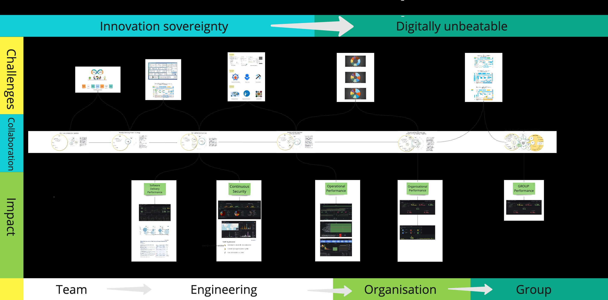

## Relevant CNCF projects


  
  
  - **Using since:** 2021
  - **Current version:** 1.29.6  

  Kubernetes has been the foundation for our Internal Developer Platform and almost all of Adobe's containerized workloads run on Kubernetes clusters.
  

  
  
  - **Using since:** 2021
  - **Current version:** v3.12.3 

  Helm is our package manager and helps us abstract out some of the complexity by including them as dependencies and only exposing the values.yaml file.
  

  
  
  - **Using since:** 2021  

  We are using all four projects under Argo:
  - Argo CD: v2.9.22
  


## Platform Engineering  @ Allianz Direct
Allianz Direct has been working on building Platform Engineering for the past several years. We have created a cloud-native future-proof platform which offers an organisation-wide-devops(orgOps) experience on top of public cloud. Business, Software Engineers, Security, Compliance, Architecture, Support and Cost Efficiency are few of our stakeholders.

### Platform Engineering Team Topology - internal

The PE team is internally organised in DDOs - Distributed DevOps, where each ddo owns a Domain.
This setup follows the reverse Conway manoeuver where the reference architecture structure dictates
the teams setup.
The PE team consist of 13 members. All of them internal employees.

The PE team is being supported by auxiliary teams:
Developer Service Hub (DSH): entry level engineers handling the low complexity tasks such as: access management, 
1st level technical support, SRE onboarding, ticket sorting and filtering
Cloud Auditing Hub (CAH): entry level engineers with a focus on compliance and audit
Production Management Hub (PMH): entry level engineers with a focus on incident and problem management
Technical Tribe Leads (TTL): Technical leads on the Tribe (department) level that became our evangelist for best practices and
continuous innovation partners.

### Platform Engineering Team Topology - external
Externally, the team has decided to scale by building on the concept of FDOs - Federated DevOps, where 
each squad (developing team) has built internal devops expertise focusing a minimum amount of time on
Operations concerns. A FDO community has flourished and enabled successfully an extremely aggressive organisation scale up
The PE serves an approx. 500 engineers and 1500 employees.

## Platform Engineering Architecture 

The PE team has built a Cloud Native Platform
that serves the core B2C business of a fully digital insurance player acting on
several european markets. 

It serves also all the newly created B2B business initiatives. 
The highly aggressive scale-up of the both B2B and B2B businesses forced the PE team to redesign the architecture towards
a multi-tenant architecture with minimum operational effort.
On top, the Platform has become a Organisation Group Standard and an example for Global initiatives. This forced the PE team to
choose a light architecture under a second Platform based on Fargate ECS, reducing the operational effort and talent demand to minimum.

PE team delivered several cloud native best practices:
- GitOps (ORGops to be more precise)
- Stateless clusters orchestrated by a management cluster
- Fargate ECS multitenancy 
- DevSecOps
- SRE

### Special projects that served us well

- AWS obsession with customers served us well. The technical support and continuous relation with AWS architects
helped us maximise our effectiveness and evolve our architecture as well as complementing our stack with SaaS services
such as EKS, Redis, MSK.

- AWS managed Kubernetes gave us the flexibility we needed to meet our users needs with as little overhead as
possible. Most of our application choices come directly from our users, however our
infrastructure choices were made to balance our compliance needs, usability and supportability.

- ArgoCD has become instrumental for us and the core of our internal innovation. We are currently using it for spinning
up and managing our multitenant implementation whether that is on namespace level or Fargate ECS level.

- PAGT(Prometheus, Alert manager, Grafana and Thanos) stack is the core of our Observability. 
It is complemented by OTEL and ELK Stack and enabled us to build a state of the art SRE journey for all our Stakeholders

### Things that worked well for us

EKS and now EKS + Fargate ECS works great for us. We can fully owns our core domains and stay hardened with minimum effort.
Complementing our Stack with AWS services especially on Persistence, Data Streaming and Storage increase our innovation speed.
ArgoCD with helm, Atlantis with terraform and Crossplane are working great for us, allowing us to follow the GitOps way,
a great way of working for heavily regulated industries.

## Stakeholders value streams

### **Business**  
  - Cost savings of X%
  - Business Delivery expedited by X%
  - Security incidents reduced by X%
  - Reliability incidents reduced by X%
  - Organizational Performance increased by X%

### **End-Customers**  
  - User Experience improved by X%
  - Fast Feedback loop increased by X%
  - Reliability increased by X%

### **Developers**  
  - DevX improved by X%
  - Fast Software Delivery improved by X%
  - Productivity increased by X%
  - High Quality increased by X%
  - Innovation increased by X%

### **Security**  
  - Cloud native Security costs reduced by X%

### **Compliance**  
  - Cloud compliance costs reduced by X%

### **Legal**  
  - Cloud native legal cost reduced by X%

### **QA**  
  - Automation increased by X%

### **FinOps/Sustainability**  
  - Cloud Costs reduced by X%

## Some things did not work as expected

Service Mesh did not work well for us. The Operational costs and lack of integration on the CNI level made us revert the journey.
Sidecar, eBPF Service Mesh seems to be the way forward for us.
 
 
## Architecture evolution

The Architecture was designed as a single tenant but due to its success it needed to evolve to support multitenancy on
AWS account level, next on namespace level and now, due to the Global impact, on the Fargate ECS level.
Inevitably we ended with three Platforms(Architectures) that need to be simplify towards a maximum two that will evolve rapidly.
Migration work is inevitable.

## The Journey
It took us 4 years to move towards the current Platform Engineering setup. There is more to come. The full Journey as it happened till today 28.10.2024 can be seen in the following diagram:

