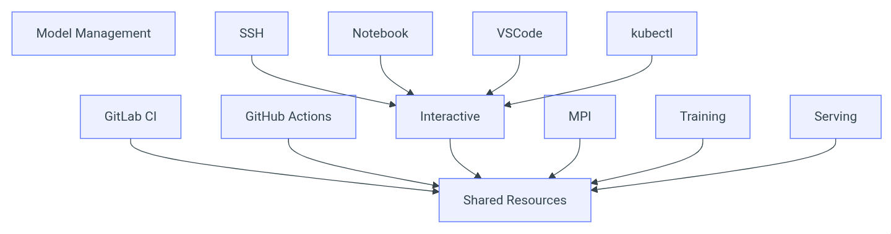
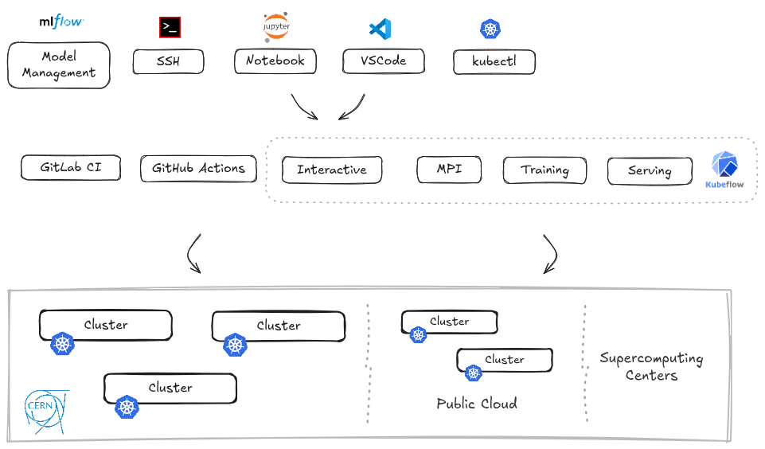
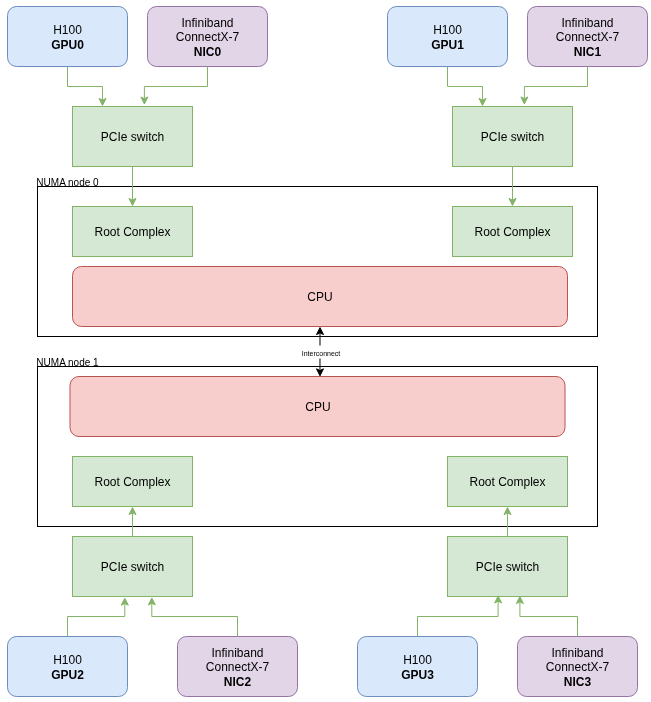

## Relevant Projects


  
  

  ArgoCD is used to manage deployments of all services across multiple clusters and environments. Argo Workflows is used to manage multiple day-2 cluster operations.
  

  
  

  Bootc provides transactional, in-place operating system images and updates using OCI/Docker container images. Bootc is used to build the minimal base images for our cluster nodes.
  

  
  

  ContainerSSH offers a SSH frontend to containers/pods running on Kubernetes clusters. Used to expose SSH as a way to access existing sessions in the cluster, with multiple authentication mechanisms offered (Kerberos, OIDC/OAuth2).
  

  
  

  Longhorn offers cloud native distributed block storage for Kubernetes. Used to offer in-cluster shared storage to users, with individual and team getting dedicated volumes with read-write-multi access and automated backups.
  

  
  

  Kubernetes provides the required workload scheduling and orchestration for the diverse workloads running in our scientific platform.
  

  
  

  Kubeflow offers tools to manage the complete MLOps lifecycle. Used for profile management and quotas for users and teams, instantiation of notebook servers, pipelines for common and reusable tasks, hyper-parameter tuning with Katib and managing inference endpoints.
  

  
  

  Kserve standardizes hosting of inference endpoints. Used to encapsulate multiple runtime flavors, such as ONNX, Triton and several others, and offering a declarative way to define inference servers.
  

  
  

  Kyverno offers policy as code with support for YAML and CEL based policies. Used as a key component for policy enforcement and mutating workloads according to those policies, adding required settings to expose storage systems, set resources based on GPUs, etc.
  

  
  

  Kueue is a kubernetes-native system offering advanced scheduling capabilities and quota management. Used to provide job queues and quotas, gang scheduling, fair sharing, among other capabilities.
  

  
  

  Prometheus gathers the metrics and insights from all components in the cluster. Used for system and service metrics as well as providing individual workload performance insights on cpu, memory, power and other areas.
  

  
  

  stargz-snapshotter provides lazy pulling of container images. Used to handle efficient job start and execution with image sizes of over 100GB in some cases.
  


Some additional projects outside the CNCF are essential to this deployment.
* [MLFlow](https://mlflow.org/), a project under the Linux Foundation used for model management and versioning
* [Nvidia GPU operator](https://github.com/NVIDIA/gpu-operator) to setup and manage drivers and configurations for Nvidia GPUs
* [AMD GPU operator](https://github.com/ROCm/gpu-operator) to setup and manage drivers and configurations for AMD GPUs

## TLDR; Synopsis

This reference architecture describes a deployment supporting multiple teams in CERN’s new flagship “[Next Generation Triggers](https://nextgentriggers.web.cern.ch/)” project, looking at innovative computing technologies for data acquisition and processing for the High-Luminosity Large Hadron Collider and beyond.

The cluster and platform target:

* Multiple scientific use cases, covering **traditional numerical computing** as well as **machine learning workloads** across the different CERN experiments. Scientific computing and in particular high performance computing (HPC) have relied on cloud native tooling for parts of their workloads for several years, but relied on tools like SLURM for advanced scheduling capabilities. This is our first production deployment to offer the full stack based only on cloud native infrastructure
* Access to both accelerators (in particular **GPUs**) as well as specialized nodes such as **high CPU core count** and **high CPU clock frequency**. In an earlier stage of experimentation also **FPGAs** are being integrated targeting fast inference in the CERN experiment online filters
* In a shared pool of resources allow **interactive access (including SSH, VSCode, Notebooks and just kubectl), traditional batch, MPI and training workloads and inference**
* Integration with the existing infrastructure at CERN for CI / CD systems (on-premises GitLab and GitHub), identity, and efficient access to multiple storage systems for both user and physics data

A pure cloud native based infrastructure can now successfully serve scientific computing workloads, with advanced scheduling features such as co-scheduling, fair sharing, among others.

## Use Cases & Requirements

A set of requirements and use cases was initially defined when designing the architecture. The figure below shows how a shared pool of resources, mostly on-premises but integrating public cloud and supercomputing centers, should be accessed from different services.

Below we highlight specific requirements in terms of hardware and user facing functionality.

### Hardware

* Support for an **heterogeneous set of resources**: multiple CPU types, GPUs from multiple vendors, FPGAs and specialized accelerators, all in a shared pool of resources
* Integration with **multiple network interconnects** targeting low latency, including at least Infiniband and RDMA over Converged Ethernet (RoCEv2)
* A **hybrid deployment** integrating external resources, both from public cloud providers and supercomputing centers

### User Facing

* **Curated environments** based on container images and maintained by the platform team for the most common user setups, covering ML workloads but also traditional scientific computing. Particularly important has been ensuring these environments are compatible with the existing ways of working, with session environments setup with backwards compatibility for existing physicist tools and scripts 
* Easily **customizable environments**, either via dedicated environments maintained by user teams or the ability to install additional packages at runtime. This means users have sudo capabilities inside their sessions
* **Interactive access** to sessions with the ability to choose the amount of GPUs at creation, and a corresponding CPU and memory allocation depending on the type of GPU selected. Once created, access available to the session via notebooks, local vscode instances and most importantly **SSH for compatibility** with the existing ways of working
* **Batch access** to resources, with support for advanced scheduling capabilities such as queues, quotas, co-scheduling, fair sharing. In addition to the high priority user submissions of training or MPI jobs, the system should be able to backfill unused resources with lower priority workloads to ensure high usage efficiency
* Support for the complete **machine learning lifecycle**, including data preparation, training, hyper-parameter tuning and model inference. In particular, support, efficient integration and automation using common training and tuning frameworks
* **Model management and versioning**, integrated with the rest of the platform with collection and storage of training metadata and logging

## Architecture

The diagram below shows how the different projects and tools match the requirements.

Areas of particular interest where effort was required include compute, scheduling, networking, storage and observability.

### Compute

**Proper isolation and reproducibility** is essential for reliable performance and results, removing the effect of noisy neighbors and the latency between CPU and GPU. GPU nodes follow a NUMA-aware dual-socket layout, designed to preserve locality between CPU, memory, and accelerator resources. Each node has two CPU sockets, exposed as two NUMA nodes.

Depending on the node type, GPUs are distributed evenly across these NUMA domains: either 8 GPUs per node, with 4 GPUs attached to each NUMA node, or 4 GPUs per node, with 2 GPUs attached to each NUMA node.

Some relevant configurations to ensure the desired reproducibility and isolation.

*CPU and memory resource allocations (requests and limits)* scale with the number of GPUs requested by a session: pods receive resources in proportion to the selected GPU count while remaining aligned with the corresponding NUMA locality. This minimizes cross-socket communication, reduces latency between CPU and GPU, and improves the consistency of performance-sensitive workloads

*Control CPU Management Policies on the Node*, as [documented here](https://kubernetes.io/docs/tasks/administer-cluster/cpu-management-policies/) with the following settings on the kubelet.
* `cpu-manager-policy=static`
* `cpu-manager-policy-options=full-pcpus-only=true`
* `memory-manager-policy=Static`
* `topology-manager-policy=restricted`

*Reserved systems resources* for kubelet and other add-ons.
* `system-reserved=cpu=2,memory=1000Mi`
* `reserved-memory=0:memory=1000Mi`

**Efficient access and distribution of container images**, to accelerate the start of sessions based on both curated and custom environments each being multiple 10s of GBs in size. We provide this with a custom daemonset pre-pulling all curated images in advance when published, as well as the ability to do image streaming with the stargz-snapshotter.

**Capability to burst out to external resources,** in particular public cloud providers and HPC resources.

### Scheduling

[**Bin packing**](https://kubernetes.io/docs/concepts/scheduling-eviction/resource-bin-packing/) **in the scheduling profile** instead of the default workload spread across nodes, with strategy `MostAllocated` ensuring better availability for workloads requiring full nodes.

**Advanced scheduling features** for queues supporting different resource types and QoS, workload co-scheduling, quotas and fair sharing to optimize overall resource utilization.  
Kueue is the main component being used to achieve the advanced scheduling functionality we need.

### Networking

**Low latency networking** such as Infiniband and RDMA over Converged Ethernet (RoCEv2) supporting both traditional CPU and GPU MPI workloads. Currently done by enabling hostNetwork and exposing the corresponding PCI devices for these specific use cases. Driver and lifecycle management of IB/RoCEv2 networking resources is controlled using the Nvidia network operator.

### Storage

Users get different storage tiers which fit different usages.

#### Node local

Very high IOPS but limited space, typically on the low TBs available to all workloads on that node. Not useful for multi-node jobs requiring a shared filesystem. Used also for GPU Direct Storage (GDS) with local NVMEs.

#### Cluster local

Shared filesystem across all nodes in the cluster, deployed using Longhorn. Limiting the number of network hops as much as possible ensures reasonable IOPS and scales out well in space available with the number of nodes in the cluster (typically 10s of TBs per node). Connection through a single switch for higher performance, as much as possible. Volumes stored in this filesystem are backed up to S3 storage relying on the internal Longhorn backup functionality, with incremental points daily for a week and monthly.

#### Central

Shared filesystem outside the cluster with much higher storage space available. Managed using CEPH with different IOPS available, up to 2000 guaranteed with bursting to higher values.

### Observability

The stack provides visibility into hardware performance, resource efficiency, and environmental impact.

#### Telemetry Collection

Leveraging a multi-layered collection strategy integrated with the kube-prometheus-stack.

**Accelerators**: NVIDIA dcgm-exporter and AMD device-metrics-exporter provide deep-field GPU telemetry (utilization, memory, power, temperature, and frequency).

**Power & Sustainability**: IPMI and Kepler capture hardware-level power metrics. Kepler utilizes RAPL to attribute energy consumption to individual workloads.

**System Metrics**: Standardized node and container metrics are ingested via Prometheus for a unified view of the cluster.

#### Visualization and Analysis

Data is exposed via Grafana through three specialized dashboard tiers.

**Cluster Overview**: Tracks aggregate utilization (CPU, GPU, RAM, Network, Thermals) and node-level health. It highlights idle resources and historical trends to guide capacity planning.

**User/Workload Analytics**: Provides namespace-filtered views for individual developers to monitor their specific deployments. This view balances resource efficiency (allocated vs. actual usage) with performance profiling (GPU/CPU/RAM saturation) and power consumption, allowing users to independently debug bottlenecks and optimize job performance.

**Sustainability Tracking**: A dedicated dashboard for CO2-equivalent emissions, offering transparency into the carbon footprint at both the cluster and individual workload levels.

#### Alerting and Optimization

Alertmanager is configured to trigger notifications for idle resources. By monitoring the delta between allocated requests and actual utilization, the system identifies "zombie" workloads or over-provisioned namespaces, allowing for potential automated or manual resource reclamation to reduce costs and energy waste.

## What works particularly well

**Workload isolation** which is a key aspect when considering needs for reliable benchmarking results. Recent versions of Kubernetes have all the required capabilities to ensure NUMA affinity between CPUs and GPUs, resource pinning to individual workloads and reservation for system services and add-ons.

**GPU setup, configuration and monitoring** with well supported and up to date operators for both Nvidia and AMD GPUs and automation for metric collection on utilization, power, memory, etc. This includes the initial node configuration required with loading drivers and exposing them to the workloads, as well as day-2 operations such as driver upgrades with integration with the default methods for cordoning and draining nodes.

**Kyverno for validation and mutation** of cluster resources, allowing a policy based mutation of the resource capabilities based on labels available to users. This ranges from attaching volumes for access to external storage, setting environment variables such as home directories or authentication, automation of resources for cpu and memory and many others. Validation policies also include ensuring users do not attempt invalid NUMA allocations of CPUs and GPUs. Kyverno was chosen after the initial choice of the OPA Gatekeeper had limitations when modifying fields outside the matching location.

## What needs improvement

**GPU failure detection** and integration with the scheduler, either by cordoning nodes or blocking access to faulty GPUs. Depending on the type of fault, the device plugins (for both Nvidia and AMD) may stop exposing faulty devices, but this is not reliable in all cases. Options such as [Nvidia Sentinel](https://github.com/NVIDIA/NVSentinel) are being evaluated.

**GPU partitioning currently at node level**, limiting the ability to have in the same node devices being exposed fully and others being partitioned using MIG. This is currently not supported by the GPU operators, but should be available in the future with the DRA drivers.

**Scheduling workloads across multiple clusters**, while possible, does not allow seamless access to logs or launching interactive sessions as done for single clusters \- \`kubectl log\` and \`kubectl exec\` type of request. This is ongoing work in Kueue but currently limits the workloads submitted outside the main cluster to batch-like workloads.

**Limited support for checkpoint and restore** in several types of workloads, in particular the non machine-learning workloads. This limits the ability to push overall usage of the cluster further up by suspending / preempting idle sessions without losing any work. Efforts such as [criu](https://criu.org/Kubernetes) and  the [checkpoint-restore working group](https://kubernetes.io/blog/2026/01/21/introducing-checkpoint-restore-wg/) promise to greatly advance the capabilities of the cloud native ecosystem in this area in an workload agnostic way.

**Low latency networking** with InfiniBand or RoCEv2 in our setup is currently not namespaced and exposed to the users through *hostNetwork*. In case user workloads are not trusted, other options that provide better network-level isolation should be explored, including SR-IOV and via efforts such as [dranet](https://github.com/kubernetes-sigs/dranet).

## What sort of "glue" have you had to develop?

A key goal of our architecture was ensure the complete functionality is available via cloud native APIs, easing the integration with all other tools in the ecosystem. The glue pieces below target ease of use.

**Access via SSH** was one of the main requests from our users, allowing backwards compatibility with years of custom scripts, continuous integration and several other "ways of working" that require this type of access. We invested internally in developing the required capabilities in the [containerssh](https://containerssh.io/) project, with management of multiple sessions, multiple authenticated methods (OAuth2, Kerberos, X509), among others.

**Large number of mutating policies**, allowing us to give a better experience to users that do not want to use `kubectl` or write yaml. Relying on metadata labels in the different resources hides the complexity of setting up volume mounts, environment variables, etc. Our current policies include setting tolerations to assign workloads to specific node flavors, additional environment configurations for MPI workloads, injecting user metadata to access storage systems and interact with internal services, mounting multiple storage systems at CERN or enabling RDMA and GPU Direct Storage.

## What's next for your architecture?

**Interactive session management** via notebooks, relying on the Kubeflow Notebooks UI. As of today, users require a minimal yaml and usage of the `kubectl` client to create, list and delete their interactive sessions, even if access is then available via ssh, notebooks, vscode, etc. An upcoming improvement is to offer a UI based interface to manage sessions, likely relying on the Kubeflow Notebook UI but applying to any type of workload.

**DRA and automated partitioning** in the cluster, as currently we still rely on the Nvidia and AMD operators to manage GPU resources for this particular setup and need to manually set the desired MIG configuration for each node/pool of nodes. This will allow us to have heterogeneous configurations in the same node (with both partitioned and non-partitioned devices) as well as, in the future when the DRA drivers get this functionality, automatic partitioning of devices based on the current workloads.

**Bursting to HPC resources**, as existing supercomputers and upcoming AI factories have a large number of available GPUs. The main requirement is to integrate with SLURM as an API to manage these remote resources, but in a way that is seamless to users of the service. Projects such as [interLink](https://github.com/interlink-hq) promise to hide the SLURM backends behind the Kubernetes APIs in our platform.

## Key Takeaways / Lessons

**Adapt to existing ways of working**: the success of the platform depends on acceptance by users, who often will not have the time to change their ways of working. Anticipate where effort is needed to meet users where they're at, building the required glue on top of your cloud native infrastructure.

**Iterative and quick development**: when exposing a new platform to users with so many stack changes from previous deployments, the ability to iterate very quickly taking into account user feedback is essential. This likely means planning for an intense period after first exposing the services, with the risk of loosing users from the start otherwise.

**Upstream first**: this is only way to ensure long term sustainability of a platform, exposing requirements and working together with the rest of the community. Local, temporary patches, when required, should be done in parallel with the upstream contributions.

**Cloud native is ready for scientific computing and AI/ML**: if there were doubts, this experience cleared them up. Cloud native enables the next generation of scientific computing and AI/ML platforms, with all the advanced requirements from high performance computing together with the integration with all modern tools that talk cloud native.

## Discussion

End user members may participate in the [discussion thread](https://github.com/cncf/enduser-private/discussions/84) for this architecture.
