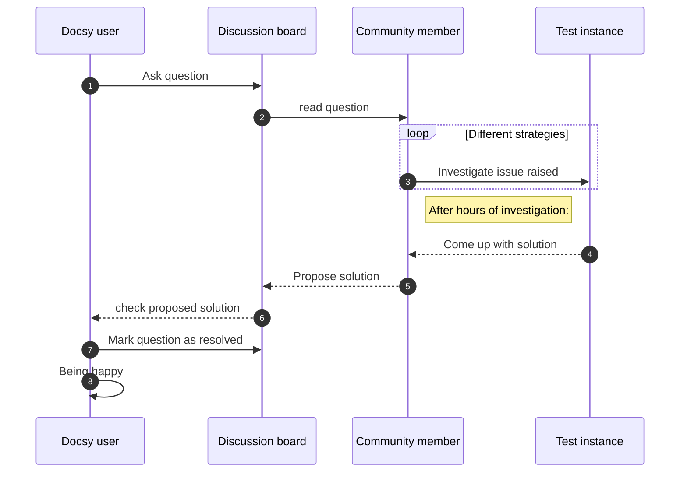

Opening blurb Opening blurb Opening blurb Opening blurb Opening blurb Opening blurb Opening blurb Opening blurb Opening blurb Opening blurb Opening blurb Opening blurb 

## Diagram

```mermaid
sequenceDiagram
    autonumber
    Docsy user->>Discussion board: Ask question
    Discussion board->>Community member: read question
    loop Different strategies
    Community member->>Test instance: Investigate issue raised
    end
    Note right of Community member: After hours of investigation:
    Test instance-->>Community member: Come up with solution
    Community member-->>Discussion board: Propose solution
    Discussion board-->>Docsy user: check proposed solution
    Docsy user->>Discussion board: Mark question as resolved
    Docsy user->>Docsy user: Being happy
```