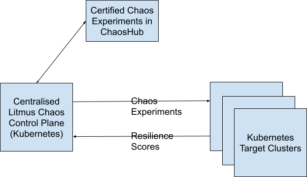
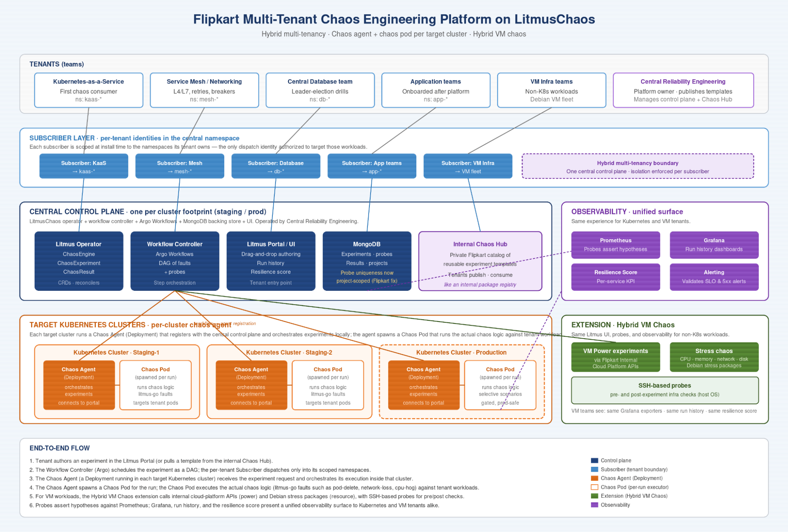

## Relevant CNCF projects


  
  
  - **Using since:** 2023

  Central chaos engineering platform. Provides Kubernetes-native chaos orchestration, a workflow controller, a probe framework, a drag-and-drop UI, and resilience scoring. Flipkart deploys a single centralized control plane (operator \+ workflow controller) and federates tenant access through subscribers — forming the foundation of the multi-tenant chaos platform.
  

  
  
  - **Using since:** 2021

  Runtime substrate for hundreds of Flipkart microservices and for the LitmusChaos control plane itself. Custom Resource Definitions (ChaosEngine, ChaosExperiment, ChaosResult) model chaos as Kubernetes objects. DaemonSets are used to provide a node-local, long-lived chaos injection surface for high-availability experiment execution.
  

  
  
  - **Using since:** 2023

  Underlying workflow engine used by Litmus to model multi-step chaos experiments — sequencing pre-checks, fault injection, probes, and recovery validation as a DAG. Flipkart’s Script Runner fault plugs into this DAG to enable dynamic target selection and context chaining between steps.
  

  
  
  - **Using since:** 2021

  Metrics backbone for both production workloads and chaos experiments. Chaos drills are validated against Prometheus-driven SLO and alert thresholds (CPU saturation, 5xx error rates, latency, queue depth). Litmus’s Prometheus probes assert hypotheses during fault injection.
  

  
  
  - **Using since:** 2022

  Used to package and roll out the centralized Litmus control plane, tenant subscribers, the DaemonSet-based injection layer, and Flipkart’s custom fault images consistently across staging and production clusters.

  

    
  
  - **Using since:** 2021

  Container runtime on Flipkart’s Kubernetes nodes. The DaemonSet injection model relies on stable runtime primitives to execute parallel chaos sessions safely on a single node.
  


## Other Projects

|                Project                | Using Since |                                                                                                                                                 Notes                                                                                                                                                |
|:-------------------------------------:|:-----------:|:----------------------------------------------------------------------------------------------------------------------------------------------------------------------------------------------------------------------------------------------------------------------------------------------------:|
|                Grafana                |     2022    | Dashboarding layer for chaos experiment telemetry. Flipkart reuses Litmus’s out-of-the-box Grafana exporters to surface experiment run history, resilience scores, and infrastructure-level signals to both Kubernetes and VM-team consumers — giving both audiences the same observability surface. |
|                MongoDB                |     2023    | Backing store for the Litmus control plane. Flipkart’s probe-uniqueness contribution required reworking a global MongoDB index into a project-scoped one to make probes truly multi-tenant.                                                                                                          |
|     Linux stress tooling on Debian    |     2023    | Internal stress packages (CPU hog, memory hog, network hog, disk-IO) targeted at the Debian host OS of Flipkart’s VM fleet, invoked by the Hybrid VM Chaos extension when the workload doesn’t live in Kubernetes.                                                                                   |
| Internal Flipkart Cloud Platform APIs |     2024    | Lifecycle APIs (start, stop, restart) for Flipkart’s VM fleet. The Hybrid VM Chaos extension calls these APIs to deliver VM-power experiments in parity with the Kubernetes-native experience.                                                                                                       |
|           Internal Chaos Hub          |     2024    | Private, Flipkart-internal catalog of pre-curated chaos experiment templates. Built so that tenants can publish, version, and consume reusable experiments across teams — the chaos-engineering analogue of an internal package registry.                                                            |

## Synopsis

Flipkart is one of India’s leading digital commerce companies, running hundreds of tightly coupled microservices across Kubernetes and VM workloads that must withstand the traffic surges of Big Billion Days and other festive sales. The Central Reliability Engineering team built a centralized chaos engineering platform on LitmusChaos to convert chaos engineering from an afterthought into a continuous practice.

On top of upstream Litmus, Flipkart engineered four high-leverage customizations: (1) a hybrid multi-tenancy model that combines the operational simplicity of a cluster-wide install with the isolation of a namespace-wide install; (2) a DaemonSet-based high-availability layer for chaos injection that runs one persistent injector per node and supports parallel sessions; (3) a first-class “Script Runner” fault that allows dynamic target selection and context chaining across steps in an experiment; and (4) a hybrid VM chaos extension that reuses the Litmus experience for non-Kubernetes workloads via Flipkart’s internal cloud APIs and Debian-host stress tooling.

The result is operational readiness validated through live chaos drills ahead of Big Billion Days, a measurable shift in engineering culture from “prevention” to “practice,” and a steady stream of upstream contributions back to the LitmusChaos project.

## Organization

Flipkart is one of India’s leading digital commerce companies, serving hundreds of millions of customers across an ecosystem that includes flagship apparel, electronics, grocery, and fintech offerings. Its flagship event, Big Billion Days, is the largest e-commerce sales event in India and drives massive concurrent traffic across a tightly integrated microservices estate. Other high-scale moments — the Independence Day sale and Diwali sale among them — generate similar surges throughout the year.

Flipkart’s engineering organization runs an extensive Kubernetes-as-a-Service platform alongside a large VM fleet, with internal central platform teams providing service mesh, networking, and database offerings to hundreds of downstream application teams. Reliability at the scale of an Indian retail tentpole event is therefore not a product-team concern — it is a horizontal platform discipline.

## Teams

Multiple teams collaborate to build, operate, and consume the chaos platform:

* **Central Reliability Engineering** — owns the chaos platform end-to-end: the centralized LitmusChaos control plane, tenant onboarding, the DaemonSet injection layer, the Script Runner fault, the hybrid VM chaos extension, the internal Chaos Hub, and upstream contributions back to Litmus.

* **Kubernetes-as-a-Service team** — first tenant of the chaos platform; runs chaos drills against the Kubernetes control plane primitives consumed by every Flipkart workload.

* **Network Services and Service Mesh team** — uses chaos to validate Layer-4/7 failure behavior, retry semantics, and circuit-breaker configurations across the mesh.

* **Central Database team** — leverages the Script Runner fault to verify leader-election behavior in leader-follower database topologies during chaos drills.

* **Application teams** — onboarded progressively after the central platform teams; consume curated experiments from the internal Chaos Hub.

* **VM Infrastructure teams** — use the hybrid VM chaos extension to obtain the same observability surface (Grafana, run history, resilience score) as Kubernetes-native consumers, despite running outside Kubernetes.

## Architecture overview & Goals

### Goals

1. **Make chaos engineering a continuous practice, not an afterthought.** Move from runbooks-on-paper to regularly rehearsed failure scenarios that feed back into incident response.

2. **Operate one chaos platform for the whole company, safely.** Provide a centralized control plane that hundreds of tenants can use without each tenant carrying operational burden — and without any tenant being able to touch another tenant’s workloads.

3. **Eliminate self-inflicted experiment failures.** Remove brittleness from the chaos infrastructure itself — specifically, helper-pod scheduling failures that were masking real reliability signal.

4. **Express realistic, real-world failure scenarios.** Support dynamic target selection and context chaining inside experiments so a single chaos run can express “find the leader, kill it, watch a new leader get elected” as one declarative workflow.

5. **Treat VM workloads as first-class citizens.** Reuse the Litmus experience for workloads that don’t run on Kubernetes — same UI, same probes, same observability — instead of building a parallel tool.

6. **Validate operational readiness for Big Billion Days.** Convert chaos drills into a measurable, repeatable pre-event sign-off rather than a manual exercise.

7. **Contribute upstream.** Push fixes and architectural patterns back into LitmusChaos so the broader CNCF community benefits and Flipkart avoids long-term fork maintenance.

### Architecture Overview

At a high level, the architecture consists of a centralised control plane that is setup on a Kubernetes namespace or cluster that helps in designing and coordinating the chaos experiments. The chaos experiments are designed, implemented and certified and finally placed in a ChaosHub, which then are used by various teams in the organization to run them on the target Kubernetes clusters. Chaos experiment results are pushed back into the control plane as resilience scores, which can be used to create resilience testing trends and resilience posture reports for various teams’ consumption.

The platform is organized into four logical layers:

The platform is organized into four logical layers:

**Control Plane Layer.** A single, centralized LitmusChaos installation — the operator, workflow controller, MongoDB backing store, and Grafana dashboards — lives in a dedicated central namespace and is operated by Central Reliability Engineering. There is one control plane per cluster footprint (staging, production), not one per tenant.

**Tenant Subscriber Layer or a chaos agent.** For each tenant team, a dedicated subscriber is deployed in the central namespace. The subscriber is scoped at install time to the set of tenant-owned namespaces it is allowed to target. The subscriber is the only Litmus identity that can dispatch chaos into a tenant’s namespaces — giving namespace-grade isolation without forcing each tenant to operate its own Litmus install.

**Injection Layer.** Instead of spawning ephemeral helper pods on-demand per experiment, Flipkart runs a DaemonSet (one replica per node, using the litmus-go image) as a long-lived, highly privileged injection surface. Experiment pods now offload target information to the node-local DaemonSet pod, which executes the chaos in parallel shell sessions. This supports concurrent chaos injection on the same node and eliminates a class of failures where the previous on-demand helper pod couldn’t be scheduled in time.

**Extension Layer.** Two domain-specific extensions plug into the platform: the Script Runner fault (a user-defined container running a user-defined script, whose stdout feeds the target list of any subsequent fault in the experiment), and the Hybrid VM Chaos extension (which uses Flipkart’s internal cloud-platform APIs for VM power operations and internal Debian stress packages for resource-level chaos). An internal Chaos Hub layers on top, letting tenants publish reusable experiment templates.

Tenants interact with the platform almost entirely through the Litmus UI. They author or pick a template from the internal Chaos Hub, attach probes (including SSH-based probes for the VM surface), and run the experiment against namespaces or VMs they own. Resilience scores, run history, and Grafana dashboards present a single observability surface regardless of whether the target is a Kubernetes workload or a VM.

#### Key Design Principles

* **Centralized control plane, federated trust.** One operator and one workflow controller for the whole organization; isolation is enforced at the subscriber boundary, not by running N copies of Litmus.

* **Persistent, node-local injection.** Trade ephemeral safety for scheduling determinism by accepting a long-lived privileged DaemonSet — a deliberate trade-off made only where the operational win (no scheduling failures during a chaos drill) outweighs the cost (privileged residency).

* **Context chaining over static targeting.** Chaos experiments are workflows, not single faults; the output of one step (“who is the leader?”) feeds the inputs of the next (“kill that pod”).

* **One experience, two surfaces.** Kubernetes and VM chaos must look, feel, and report the same to the user. The UI, probes, and observability layer are surface-agnostic; the differences are pushed down into the extension layer.

* **Practice, then expand.** Start with central platform teams that already run shared infrastructure; only then expand to application teams. Staging is the primary chaos surface; production chaos is selective and gated.

* **Upstream where possible.** Local patches create long-term maintenance burden. Bug fixes and reusable patterns go back to LitmusChaos.

## Can you expand on why you are using those projects/services?

### Why LitmusChaos

Before standardizing on Litmus, the team ran a detailed proof-of-concept across Chaos Monkey, Chaos Mesh, and LitmusChaos. Litmus won on four criteria that mattered for Flipkart’s context: it is Kubernetes-native end-to-end (aligning with the broader K8s-first direction), it ships a rich drag-and-drop UI that drives adoption beyond SREs, it is deeply extensible (custom faults were a non-negotiable requirement), and its resilience-probe model gave the team a path toward a measurable resiliency score per service.

### From single-tenant to hybrid multi-tenancy

The two install modes Litmus offers out of the box are cluster-wide (low operational burden, but no isolation) and namespace-wide (strong isolation, but every tenant has to operate its own Litmus install). At Flipkart’s scale — hundreds of teams across central platform and application areas — neither extreme works. The hybrid model takes the best of both: one centralized control plane (so no team has to run Litmus) plus a per-tenant subscriber pinned to that tenant’s namespaces (so isolation is enforced at the dispatch boundary). Litmus maintainer Karthik Satchitanand described this pattern as “a very nice model… a good balance” and has suggested it be documented upstream as a preferred mode of operation.

### Why a DaemonSet instead of helper pods

Litmus’s default execution model spins up an on-demand helper pod per experiment. At scale, in busy staging clusters with active chaos drills, those helper pods can fail to schedule — producing a chaos infrastructure failure that masquerades as the chaos itself. The DaemonSet inverts this: one long-lived pod per node, with the chaos image already present, executes parallel chaos sessions invoked by the experiment pods. This makes injection deterministic at the cost of a persistent privileged surface — a trade-off Flipkart accepts in staging, where platform availability for chaos drills matters most.

### Why a Script Runner fault

Real-world failure scenarios are rarely “delete pod X.” They are “find the current leader of a leader-follower system, delete it, and verify re-election.” Litmus’s built-in faults could not express dynamic target selection or pass state forward from one step to the next. The Script Runner is a first-class fault type that executes a user-defined container running a user-defined script; its stdout becomes the target list for any subsequent fault in the experiment, not just the immediate next one. The database team’s leader-election verification was the canonical use case that motivated this design.

### **Why a Hybrid VM Chaos extension**

A meaningful slice of Flipkart’s estate runs on VMs, not Kubernetes. Building a parallel chaos tool for that surface would have fragmented the user experience and split the observability story. Instead, the team rebuilt the existing VM Power experiment against Flipkart’s internal cloud platform APIs (start/stop/restart) and added resource-level stress chaos (CPU hog, memory hog, network hog, disk-level) using internal Debian stress packages. Because the experiments are still driven by Litmus, VM teams get the same Grafana exporters, the same experiment run history, the same resilience score tab, and the same probe model (with custom SSH-based probes for pre- and post-experiment infrastructure checks) that Kubernetes users get.

## What has worked well?

* **Hybrid multi-tenancy.** The centralized-control-plane plus per-tenant-subscriber pattern absorbed onboarding for many tenants with effectively zero per-tenant infra burden, while still preventing cross-tenant blast radius. Recognized by upstream Litmus maintainers as a candidate preferred-mode pattern.

* **DaemonSet injection.** Eliminated experiment failures caused by helper-pod scheduling issues in staging. Chaos drills now fail because the system under test failed — not because the chaos infrastructure couldn’t schedule a pod.

* **Script Runner.** Unlocked previously inexpressible scenarios such as leader-election verification. Context chaining turned chaos experiments into proper workflows rather than single-shot fault injections.

* **Unified VM and Kubernetes experience.** Reusing Grafana exporters, run history, and the resilience score tab gave VM teams a first-class user experience and avoided fragmenting the chaos tooling landscape inside Flipkart.

* **Pre-event readiness validation.** Chaos drills validated operational readiness ahead of the recent Big Billion Days sale, confirmed that CPU thresholds trigger the right alerts, that network failures surface correctly as 5xx spikes, and that weak links in deployment specs and alert configurations could be fixed before they became real incidents.

* **Cultural shift.** Engineering teams moved from “prevention” (try not to fail) to “practice” (rehearse failure), and from “panic” to “procedure” during incident response. Chaos scenarios now form the foundation of incident runbooks.

* **Internal Chaos Hub.** Tenant-published experiment templates accelerate reuse across teams — the chaos engineering analogue of an internal package registry.

## What has not worked well?

* **Privileged DaemonSet residency.** Persistent, highly privileged pods on every node are an accepted trade-off in staging but constrain how aggressively the same pattern can be deployed in production. Reducing the blast radius of the injection layer remains an open problem.

* **Multi-tenant gaps in upstream Litmus.** Several places in upstream Litmus assumed single-tenant scope — most visibly, probe-name uniqueness enforced globally instead of project-scoped (a MongoDB index issue). These needed upstream fixes before the multi-tenant model could behave correctly.

* **Terminology drift across the project.** The renaming of “experiment” to “fault” in parts of Litmus left behind frontend/backend mismatches — e.g., experiment pod-block visibility — that required cleanup contributions.

* **Heterogeneous VM hosts.** The stress chaos extension is currently scoped to Debian hosts; broadening to additional host OSes will mean factoring out the OS-specific layer.

* **Production chaos is still selective.** Most chaos still runs in staging. Building enough confidence (and enough guardrails) to run the full chaos surface in production is an ongoing journey.

* **Custom image registry support.** A long-standing (year-old) issue prevented the custom image registry setting from flowing through to the generated workflow YAML — a blocker for air-gapped and internal-registry deployments. Required a Flipkart upstream fix to resolve.

## What sort of "glue" have you had to develop?

* **Per-tenant subscriber onboarding pipeline.** Tooling and a defined onboarding flow so that adding a new tenant means deploying a scoped subscriber, registering its namespaces, and attaching it to the central control plane — without any tenant operating its own Litmus install.

* **DaemonSet injection runtime.** Replaced the on-demand helper-pod model with a long-lived, node-local DaemonSet (using the litmus-go image) that accepts target information from experiment pods and executes parallel chaos sessions in independent shells.

* **Script Runner fault.** New first-class fault type backed by a user-defined container image running a user-defined script, with stdout captured as structured context that any subsequent fault in the experiment can consume — not just the immediate next step.

* **Hybrid VM Chaos extension.** A reimplementation of VM Power on top of Flipkart’s internal cloud APIs, plus a stress-chaos suite (CPU, memory, network, disk) built on internal Debian stress packages, plus custom SSH-based probes that mirror the Kubernetes probe experience for VM workloads.

* **Internal Chaos Hub publishing pipeline.** A workflow that lets tenants publish reusable experiment templates to a private, Flipkart-internal catalog and pull them down into their own experiments.

* **Upstream fixes packaged as patches and PRs.** Probe-name uniqueness (MongoDB index), probe-name reuse-after-deletion (filtration), experiment-update duplicate-name validation, UI consistency (experiment-completion icon, GCP/Azure fault logos), custom image registry, and pod-block visibility — each shipped back to the LitmusChaos project.

## How did the Architecture Evolve**

### Journey

* **Phase 1 — Reactive runbooks.** Failure modes existed only on paper. Runbooks were written but not practiced. Chaos engineering was an afterthought.

* **Phase 2 — Tool selection.** Detailed PoC across Chaos Monkey, Chaos Mesh, and LitmusChaos. Litmus selected on Kubernetes-native design, drag-and-drop UI, extensibility, and resilience-probe model.

* **Phase 3 — Centralization.** Stood up a single centralized Litmus control plane and built the per-tenant subscriber model to hit multi-tenancy without forcing tenants to run their own installs.

* **Phase 4 — Hardening the injection layer.** Replaced ephemeral helper pods with the DaemonSet HA model after observing scheduling-induced experiment failures in staging.

* **Phase 5 — Expressing real scenarios.** Added the Script Runner fault to unlock dynamic target selection and context chaining (e.g., leader-election verification for the database team).

* **Phase 6 — Beyond Kubernetes.** Built the Hybrid VM Chaos extension so VM teams get the same Litmus experience and observability surface as Kubernetes teams.

* **Phase 7 — Internalize and contribute back.** Stood up the internal Chaos Hub for cross-team reuse and began the upstream contribution cadence back to LitmusChaos.

* **Phase 8 — Pre-event validation.** Used the platform to validate operational readiness ahead of Big Billion Days; chaos drills now feed incident runbooks directly.

### Key Lessons

* **Hybrid is the right answer for multi-tenancy at scale.** Neither cluster-wide nor namespace-wide install models fit a hundreds-of-teams organization on their own. A centralized control plane plus per-tenant subscribers is the productive middle.

* **Chaos infrastructure must be more reliable than the systems it tests.** Every false negative — a chaos experiment that failed for infrastructure reasons — erodes trust in the practice. The DaemonSet HA model exists because that trust was real and worth defending.

* **Failure modes are workflows, not single faults.** Dynamic target selection and context chaining (Script Runner) were not nice-to-have — they were the difference between toy chaos and useful chaos.

* **Treat non-Kubernetes workloads as first-class.** Pushing VM chaos through the same Litmus experience and observability surface kept the cultural and tooling story unified.

* **Start with central platform teams.** Teams that already run shared infrastructure (Kubernetes-as-a-Service, service mesh, central databases) had the runbooks and the motivation to be the first chaos consumers. Application teams followed.

* **Documentation and discipline.** Clear hypotheses before the experiment, clear results after; this is what turns a one-off chaos run into reusable organizational knowledge.

* **Don’t roll chaos out everywhere at once.** Pilot, learn, then expand. The internal Chaos Hub exists because the expansion phase needed reusable artifacts, not from-scratch experiments per team.

* **Recovery time matters as much as prevention.** You can’t prevent every failure, but you can systematically improve how quickly you recover from it — and chaos drills are the most honest measurement of that.

* **Contribute upstream.** Local patches become long-term debt; upstream contributions become permanent improvements for everyone, including Flipkart’s future self.

### What's next for your architecture?

* **Production chaos at scale.** Expand selective production chaos runs into a more regular, more comprehensive practice — with new guardrails for the injection layer to reduce the privileged surface area.

* **Broader host OS support for VM chaos.** Factor out the OS-specific stress layer so the hybrid VM chaos extension is not tied to Debian.

* **Deeper integration with incident runbooks.** Close the loop so that every documented incident generates (or updates) a corresponding chaos scenario.

* **Resiliency score as a service-level metric.** Promote the Litmus resilience score from “informational” to a tracked, dashboarded, team-level reliability KPI.

* **Continued upstream contribution.** Push the hybrid multi-tenancy pattern, the DaemonSet HA injection model, and the Script Runner fault toward generalization in upstream LitmusChaos for the broader CNCF community.

* **Chaos in CI/CD.** Move from out-of-band chaos drills to chaos gates that run as part of the deployment pipeline for high-tier services.

* **Observability and AIOps.** Use the rich telemetry produced by repeated chaos runs to drive AI-assisted blast-radius prediction and pre-event readiness scoring for events like Big Billion Days.

## Community Contributions

| Contribution | Details |
| :---- | :---- |
| **Probe scoping fix** | Made probe-name uniqueness project-scoped instead of globally scoped (MongoDB index fix), enabling true multi-tenant use of probes in LitmusChaos. |
| **Probe name reuse** | Filtration fix that allows probe names to be reused after deletion — removed a stale-record blocker for teams iterating on probe definitions. |
| **Experiment update bug** | Fixed a duplicate-name validation that was incorrectly firing on tag/description-only edits when updating an experiment. |
| **UI consistency fixes** | Corrected the experiment-completion icon; fixed fault-card logos for GCP and Azure faults that were rendering the generic Litmus logo. |
| **Custom image registry** | Fixed long-standing (year-old) issue so the custom image registry setting correctly reflects in the generated workflow YAML — essential for air-gapped and internal-registry deployments. |
| **Pod-block visibility** | Fixed experiment pod-block visibility on the portal; resolved terminology drift between frontend and backend after the “experiment → fault” rename. |
| **Architecture pattern** | Hybrid multi-tenant architecture (centralized operator \+ per-tenant subscriber) recognized by Litmus maintainers as a candidate preferred mode of operation to be documented upstream. |
| **Conference contribution** | Case study presented at KubeCon India keynote (2026), sharing the multi-tenant chaos platform pattern with the broader CNCF community. |

## Voices from the team

*“We moved from prevention to practice; instead of just trying to prevent issues, we actively practice handling them. And for incident response, we’ve gone from panic to procedure.”*

— Khushi Tiwari, Software Developer, Central Reliability team

*“Implementing Litmus chaos at the kind of scale we operate at, and enabling the platform teams that directly impact hundreds of development teams — that’s been a very rewarding journey.”*

— Aditya, Software Developer, Central Reliability team

*“The scenarios we test become the foundation for our incident runbooks, which makes the actual incident response much better.”*

— Hashith, Site Reliability Engineer

## Discussion

End user members may participate in the [discussion thread](https://github.com/cncf/tab/discussions/135) for this architecture.