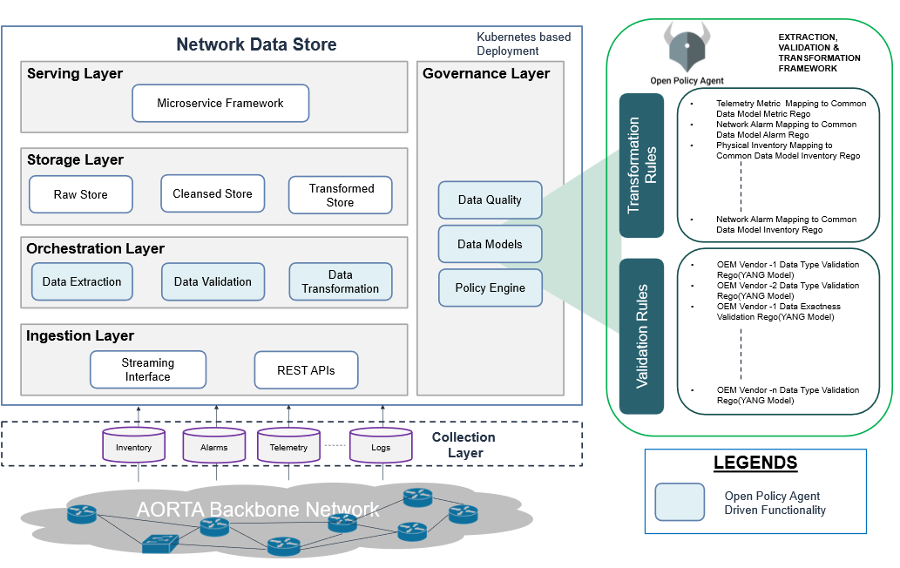
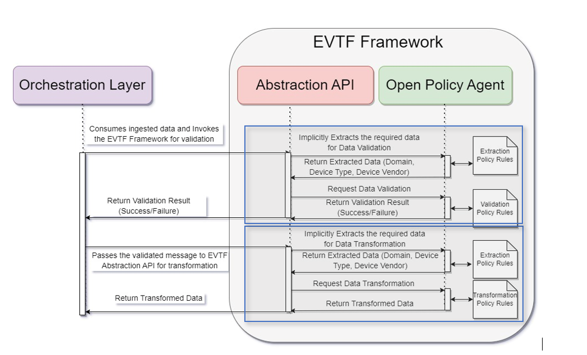

## Relevant CNCF projects


  
  
  - **Using since:** 2022
  - **Current version:** 1.29.6  

  Kubernetes is leveraged for high availability, scalability, and performance across ingestion and serving layers while implementing centralized data store by providing a centralized, scalable, and policy-driven platform for managing network and service-related data.
  

  
  
  - **Using since:** 2022
  - **Current version:** v1.9.0

  Opa is our policy engine used to enforce fine-grained, declarative policies across cloud-native environments.
  


## Centralized Data Management for a European Operator
Client’s current landscape presents several key challenges hindering the adoption of automation and AI within the network landscape. The existence of fragmented legacy systems and a complex array of tools, lacking a unified source of truth, created significant obstacles. These includes
 - Data silos
 - Disparate data
 - Diverse network 

Achieving improved interoperability to enable seamless data exchange across various applications and services was another critical hurdle. The core objective of this solution is to establish a robust and agile Centralized data hub, to address the challenges and enable seamless data sharing and interoperability across the Telco ecosystem. By integrating Open Policy Agent (OPA) as the validation and transformation engine, the aim was to enforce consistent data policies and ensure data integrity, thereby streamlining operations and fostering data-driven decision-making.

## Solution Overview
Infosys helped a European telecom operator overcome fragmented legacy systems and data silos by building a centralized, cloud-native data hub. Leveraging Kubernetes for orchestration and OPA for policy-driven validation and transformation, the solution improved data quality, consistency, and operational efficiency across the network landscape.
- **Centralized Data Hub:** Unified data from diverse network systems, eliminating silos and enabling seamless data sharing.
- **Kubernetes-based Architecture:** Ensured modularity, scalability, and resilience for all platform components.
- **OPA-driven Validation & Transformation:** Used OPA policies (Rego) for dynamic, configuration-driven data validation and transformation, decoupling business logic from application code.
- **Microservices & APIs:** Exposed data through APIs for easy integration with OSS and orchestration systems.

## Architecture Overview
A key architectural principle is the adoption of a configuration-driven, low-code/no-code approach. An Extraction, Validation and Transformation Framework (EVTF) using Open Policy Agent (OPA) unifies the handling of data across Telecom Domains. OPA enables the definition of policies as code using the Rego language, allowing for centralized, declarative control over how data is processed and validated. This framework decouples business logic from application code, making it easier to update rules and policies without redeploying services. It also supports reusability and consistency across different components of the platform.
By leveraging OPA and external configuration files, the platform allows users to define and modify data processing rules without writing application code. This empowers non-developers to manage data workflows and policies through a user-friendly interface, potentially built with frameworks like Swagger. 
The platform consumes data from diverse vendor-specific sources through the Data Collection and the Ingestion Layer. The ingested data is then taken by the Orchestration Layer to perform the extraction and validation with the help of the Policy Engine Framework. This process ensures only accurate and reliable data enters the Network Data Store.

## Initial Architecture
A simplified high-level diagram describes the unified platform for data management

## Key Use Cases
- **Network Data Validation:** Ensured data completeness, accuracy, and integrity using OPA policies before storage or processing.
- **Network Data Transformation:** Standardized vendor-specific data models into industry models (TM Forum, IETF, MEF) for interoperability.

## Outcome
The implementation of a centralized data store has wide-ranging impacts across business, technical, and operational domains. It provides a centralized, scalable, and policy-driven platform for managing network and service-related data. By unifying ingestion, validation, transformation, and serving capabilities, it enhances data quality, reduces duplication, and simplifies integration with downstream systems. The use of Open Policy Agent (OPA) introduces a flexible, low-code approach to managing business rules, enabling faster adaptation to evolving needs.

## Key Impacts include:
- **Improved Data Consistency**: Centralizes and standardizes data from multiple sources, ensuring a single source of truth for internal systems.
- **Data Quality Improvement (DQI)**: Potentially increase DQI by ~80%, significantly reducing data errors and inconsistencies.
- **Faster Decision-Making**: Enables reliable and timely access to validated data, accelerating analytics and operational insights.
- **Policy-Driven Design**: Decouples business logic from application code using OPA, allowing rules to be updated without code changes.
- **Cloud-Native Scalability**: Leverages Kubernetes for high availability, scalability, and performance across ingestion and serving layers.
- **Operational Efficiency**: Ensure the right data is available the first time, improving efficiency by ~30% estimated across network lifecycle stages (Plan, Build, Deploy).
- **Operational Cost Reduction**: ~50% reduction in data management operational costs
- **Service Level Improvement**: Enhanced service levels by 20% through better SLA management with real-time analytics.
- **Enhanced Compliance and Auditability**: Supports consistent enforcement of data quality, transformation, and access control policies.
- **Flexibility and Agility**: Configuration-driven approach allows rapid onboarding of new use cases and data sources without major rework.
- **Vendor Model Abstraction**: Transforms vendor-specific data into standard models, reducing integration complexity for downstream consumers.
- **Customer Retention and Experience**: Boost customer retention and improve overall customer experience.
- **Accelerated AI & Automation**: Faster realization of AI and automation use cases i.e.~60% expected due to improved data quality and integrity.

## Can you expand on why you are using those projects/services ?

- **Cloud-Native Implementation**:
  Leveraged CNCF projects & technologies to implement the network data store aligned with microservices-based architecture, improving scalability and agility.
- **Kubernetes for Orchestration**:
  Adopted Kubernetes to manage containerized workloads, enabling automated deployment, scaling, and resilience.
- **Open-Source & Cost Efficiency**:
  CNCF components provides vendor-neutral, cost-effective building blocks for container orchestration and observability.
- **Policy-Driven Automation**:
  Open Policy Agent (OPA), a CNCF project, powers the Extraction, Validation, and Transformation Framework (EVTF), enabling centralized, declarative policy control and low-code/no-code updates.
- **GitOps Continuous Delivery**:
  Declarative , git-based deployment for all Kubernetes resources. Perfect fit for configuration-driven architecture, allowing policy and workflow changes to propagate automatically.
- **Kubernetes Package Manager using Helm**:
  Simplifies the complex deployment of components in Network Data store including custom microservices. It provides required modularity enabling independent upgrades and scaling of components.
- **Declarative & Configuration-Driven Approach**:
  CNCF tools align with the low-code/no-code principle by enabling declarative configuration management.

## What has worked well ?

Our implementation delivered several notable successes that strengthened the overall architecture and operational outcomes:

- **Layered Architecture for Robustness**: The Network Data Store (NDS) follows a well-structured layered design—Ingestion, Orchestration, Storage, Governance, and Serving—ensuring clear separation of concerns and scalability.
- **Vendor-Agnostic Data Handling**: The solution effectively processes heterogeneous vendor data formats (e.g., Juniper, Cisco, Nokia) through a policy-driven validation and transformation framework, enabling interoperability.
- **Modern Cloud-Native Foundation**: Adoption of Kubernetes-based architecture provided agility, resilience, and dynamic scaling capabilities.
- **Policy-Driven Low-Code/No-Code Approach**: Leveraging Open Policy Agent (OPA) for policy-as-code introduced centralized governance, flexibility, and simplified rule management.
- **Dynamic and Configurable Framework**: Empowered non-developers, such as network operators, to manage workflows via user interfaces, improving operational efficiency.
- **GitOps-Based CI/CD**: Integration of Argo CD and Helm enabled declarative deployments, component-level upgrades, and streamlined release management.
- **Operational Benefits**: Achieved significant improvements in data quality, consistency, and integrity, enabling data-driven decision-making across the network ecosystem.
 

## What has not worked well ?

While the architecture delivered significant improvements, several challenges emerged during implementation:

- **High Infrastructure Costs**: The initial decision to host the end-to-end Network Data Store solution on-premises resulted in higher infrastructure expenses.
- **Processing Large Data Volumes**: Handling massive amounts of network data and delivering it to consuming applications in near real-time proved complex and resource intensive.
- **Complex Data Collection**: Data was sourced from multiple controller systems and network devices directly, increasing integration complexity and making consumption more challenging.
- **Diverse Data Types**: The varying nature of network data—including logs, metrics, and alerts—added complexity to data processing and validation workflows, requiring advanced policy-driven mechanisms.

## What sort of “glue” have you had to develop to enable usage of your architecture ?

The reference architecture provides a strong foundation, making it practical and easy to use. The below elements were designed to simplify adoption, improve usability, and ensure seamless interaction across layers acting as the "glue":

- **Unified Abstraction APIs**: Developed APIs that hide complexity and provide a consistent interface for orchestration and other consuming Operational Support Systems (OSS).
- **Policy Integration Layer**: Built connectors and loaders to dynamically apply OPA policies across different stages without requiring deep technical intervention.
- **Workflow Orchestration Logic**: Implemented routing and decision-making mechanisms to automate data flows based on validation and transformation outcomes.
- **Polyglot Storage**: Created connectors for multiple storage types to handle diverse data formats efficiently.

## Has your architecture evolved ? What lessons have you learned from previous iterations ?

Our architecture has evolved through an iterative process, starting with foundational layers and progressively incorporating advanced components based on insights from proof-of-concept implementations. Each iteration brought valuable lessons that shaped the current design.

## Key Enhancements and Learnings:

- **Policy-Driven Configuration Framework**: After evaluating multiple options, we adopted Open Policy Agent (OPA) as a reusable framework for extraction, validation, and data transformation. This approach enforces consistency and simplifies governance across telecom domains.
- **Data Product Approach for Serving Layer**: Transitioned to a data product model, introducing domain-specific microservices that publish data in standardized formats for improved interoperability.
- **Standardized Data Transformation**: Leveraged OPA to dynamically transform vendor-specific data into a common data model aligned with industry standards (TM Forum, IETF, MEF).
- **Deployment Flexibility with CNCF Components**: Initial deployment practices were rigid; we enhanced scalability and agility by integrating Argo CD and Helm, enabling GitOps-driven, declarative deployments.
- **Polyglot Storage Strategy**: Recognizing the diverse nature of network data, we moved away from a single storage type to a polyglot storage approach, selecting the most suitable database for each data category to optimize performance and scalability.

This iterative evolution has resulted in a robust, modular, and cloud-native architecture that addresses the complexity of telecom data ecosystems while ensuring flexibility for future growth.

## What’s next for your architecture ? What are you looking to do next ?

While the reference architecture is now well-defined and stable, the next phase focuses on extending its applicability across multiple cloud environments. Our goal is to implement the same architecture using managed services offered by leading cloud providers such as AWS and Google Cloud, and benchmark their capabilities against existing CNCF components. This approach will help us evaluate trade-offs in scalability, cost optimization, and operational efficiency, ensuring the architecture remains future-ready and cloud-agnostic.