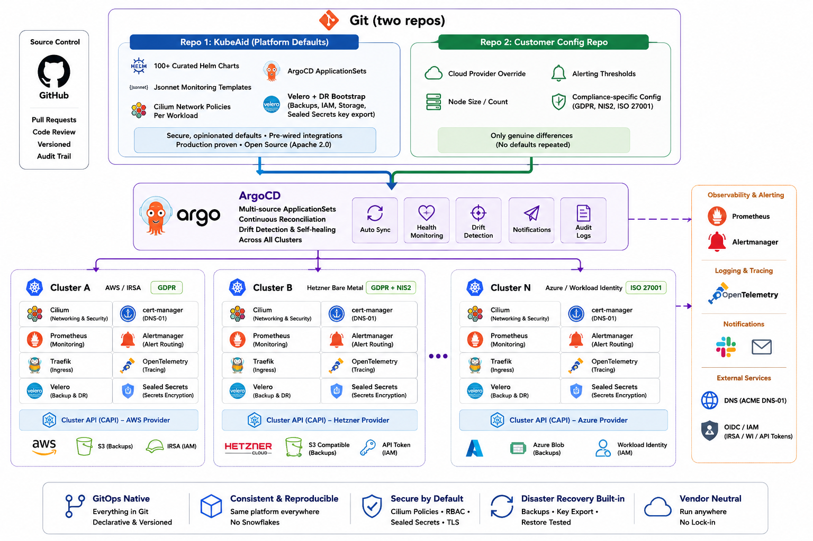

## Relevant Projects



  
  
  - **Using since:** 2019
  - **Current version:** 1.33.x

  The runtime substrate for all workloads. Cluster API manages the lifecycle of every cluster across Hetzner bare metal, AWS, and Azure declaratively from Git. No cloud console required.
  

  
  
  - **Using since:** 2021
  - **Current version:** v3.x

  The reconciliation engine for the entire fleet. A fix committed once to the shared KubeAid chart library propagates to every cluster on the next ArgoCD sync no manual per-cluster patching.
  

  
  
  - **Using since:** 2020
  - **Current version:** v3.x

  Generated per-cluster from a single Jsonnet vars file using kube-prometheus. Custom alerting rules for TLS expiry forecasting, backup SLIs, database replication lag, and Kubernetes ListWatch failures compose with upstream rule libraries without YAML merge conflicts.
  

  
  
  - **Using since:** 2022
  - **Current version:** v1.17.x

  Network policies are embedded alongside every workload manifest in KubeAid. FQDN egress rules for every external API dependency ship with the chart. Operators do not write network policies — KubeAid writes them once and applies them to every cluster.
  

  
  
  - **Using since:** 2021
  - **Current version:** v1.17.x

  Defaults to DNS-01 ACME challenge validation with cloud-specific IAM scoping: IRSA on AWS, Workload Identity on Azure, API tokens on Hetzner. A CertificateNotReady alerting rule and external TLS expiry probe ship as KubeAid defaults  added after a silent TLS expiry failure in production.
  

  
  
  - **Using since:** 2021
  - **Current version:** v1.15.x

  Backup schedules, IAM policies, and object storage (S3, GCS, Azure Blob) are provisioned at cluster bootstrap. Velero also exports the Sealed Secrets private key to external object storage at bootstrap — making DR proven at provision time, not during a drill.
  

  
  
  - **Using since:** 2022
  - **Current version:** v1.10.x

  Manages cluster lifecycle declaratively across Hetzner bare metal, AWS, and Azure. MachineHealthChecks detect and replace unhealthy nodes automatically. Cluster topology is version-controlled in Git.
  

  
  
  - **Using since:** 2019
  - **Current version:** v3.x

  Over 100 curated Helm charts form the KubeAid chart library. Each chart ships with pre-wired Cilium network policies, Prometheus alerting rules, and ArgoCD ignoreDifferences configurations. Customers override only genuine differences.
  



## TLDR; Synopsis

This reference architecture describes how Obmondo operates production Kubernetes for dozens of customer clusters across four cloud providers and bare metal with a team of under 10 engineers using a two-repo GitOps pattern built entirely on CNCF projects.

The core insight: every production failure fixed once in the shared platform repo (KubeAid) propagates to every cluster on the next ArgoCD sync. No cluster is ever patched manually. No cluster becomes a snowflake.

This architecture targets:

- **Zero snowflake clusters** — a fix committed once applies everywhere within hours via ArgoCD
- **Full EU data sovereignty** — identical stack on Hetzner bare metal in Germany, on-premises datacentres, and EU-region cloud VMs, with no vendor control plane, no proprietary APIs, and full auditability
- **Disaster recovery by default** — backup schedules, IAM, and Sealed Secrets key export are automated at cluster bootstrap; if a cluster can be created, it can be recovered
- **Sub-10-engineer fleet operations** — platform-level abstractions that scale cluster count without scaling headcount

## Organization

Obmondo (EnableIT ApS) is a Danish Managed Kubernetes provider. It builds and operates production Kubernetes platforms for customers in financial services, healthcare, and public sector organizations across Denmark and the EU. All infrastructure must satisfy GDPR, NIS2, and in many cases ISO 27001 — by architecture, not by policy.

KubeAid, the open-source platform that powers Obmondo's managed service, is available at [https://github.com/Obmondo/KubeAid](https://github.com/Obmondo/KubeAid) under the Apache 2.0 license.

## Teams

**Platform Engineering** maintains KubeAid  the shared chart library, Jsonnet monitoring templates, and ArgoCD application definitions that apply uniformly to every cluster. A fix here reaches every customer automatically.

**SRE / Customer Operations** handles day-2 operations: incident response, capacity planning, and customer-specific overrides in per-customer config repos. With KubeAid abstracting the platform layer, this team focuses exclusively on the ~10% that is genuinely different per customer.

## Architecture

### Goals

**Eliminate snowflake clusters.** Every production failure becomes a KubeAid default. The silent TLS expiry became DNS-01 + external probe + alert. The duplicate Prometheus timestamp alert became a scrape-level relabeling rule. The RBAC gap became a ClusterRole fix. Each fix landed once; every cluster received it automatically.

**EU data sovereignty without vendor lock-in.** No proprietary control plane. No per-node SaaS fees. No APIs that cannot be audited. The entire stack runs on CNCF projects identically on Hetzner bare metal in Germany, on-premises in Danish datacentres, and in EU-region cloud VMs. Customers can move it, fork it, and audit every component.

**Disaster recovery proven at provision time.** Backup schedules, IAM policies, object storage, and Sealed Secrets private key export are automated at bootstrap. The DR gap was discovered simultaneously on every cluster during a planned drill  and made impossible to miss on any future cluster.

**Observability without per-cluster overhead.** Monitoring configuration is generated from a single Jsonnet vars file. One engineer maintains alerting for the entire fleet. Custom rules compose with upstream libraries without merge conflicts.

### Architecture Overview

The architecture follows a strict two-repo pattern:
**Repo 1 — KubeAid (shared platform defaults)**
Over 100 curated Helm charts with pre-wired integrations. ArgoCD ApplicationSets deploy these charts to every cluster. Monitoring is generated per-cluster from a single Jsonnet vars file using kube-prometheus. Cilium network policies ship alongside workload manifests. DR configuration is provisioned at bootstrap. Every production failure becomes a default here.

**Repo 2 — Customer config (genuine differences only)**
Each customer config repo holds only what is genuinely different: cloud provider, node sizes, alerting thresholds, compliance scope. If a value matches the KubeAid default, it does not exist in the config repo. ArgoCD reconciles both repos continuously across every cluster.

**Per-cluster stack (all CNCF projects):**

| Layer | Project | Role |
|-------|---------|------|
| Lifecycle | Cluster API | Declarative cluster provisioning across all providers |
| Networking | Cilium | CNI + FQDN egress policies + Hubble metrics |
| TLS | cert-manager | DNS-01 ACME with cloud IAM scoping |
| GitOps | ArgoCD | Continuous reconciliation from both repos |
| Observability | Prometheus + Alertmanager | Generated from Jsonnet per cluster |
| Ingress | Traefik | Wildcard TLS, HTTP→HTTPS redirect |
| Backup / DR | Velero | Scheduled backups + Sealed Secrets key export |
| Secrets | Sealed Secrets (Bitnami) | Encrypted secrets in Git, key exported at bootstrap |

### Infrastructure Layer

Cluster API manages cluster lifecycle across all providers. The same declarative topology definition works on Hetzner bare metal (HCloud provider), AWS, and Azure. MachineHealthChecks detect unhealthy nodes and trigger automatic replacement. Node removal by CAPI is tracked and DaemonSet ghost pods are handled via alerting.

On Hetzner bare metal, clusters run on dedicated physical servers with ZFS and Ceph storage. Network isolation is enforced by Cilium at the pod level. No hypervisor, no shared infrastructure with other tenants.

### Networking Layer

Cilium is the CNI for every cluster. Every KubeAid Helm chart ships with a `CiliumNetworkPolicy` alongside the workload manifest. FQDN egress rules for every external API dependency are pre-written and applied by ArgoCD. Operators do not write network policies  they are a platform default.

FQDN policy enforcement is critical for compliance: customers need to attest that workloads only communicate with approved external endpoints. Cilium's Hubble metrics feed into Prometheus for network observability.

### TLS and Certificate Management

cert-manager defaults to DNS-01 ACME challenge validation. The switch from HTTP-01 was forced by a production failure: Traefik's global HTTP→HTTPS redirect for HSTS compliance made HTTP-01 ACME validation permanently impossible  every challenge request was redirected before reaching the solver pod. Certificates failed to renew silently for up to 90 days.

DNS-01 with cloud-specific IAM scoping (IRSA on AWS, Workload Identity on Azure, API tokens on Hetzner) is now the only supported challenge type. An external TLS expiry probe and a `CertificateNotReady` Alertmanager rule ship as KubeAid defaults.

### Observability Layer

Prometheus and Alertmanager are generated per-cluster from a single Jsonnet vars file using kube-prometheus. Custom alerting rules compose with upstream rule libraries using Jsonnet merging semantics  no YAML merge conflicts.

Custom rules added after production failures:
- `CertificateNotReady` — 30-day TLS expiry warning
- `VeleroBackupMissed` — backup age SLI
- `PrometheusKubernetesListWatchFailures` — RBAC-induced scrape gaps
- `KubeDaemonSetMisScheduled` — CAPI node removal detection
- Database replication lag alerts per database type

One engineer maintains monitoring configuration for the entire fleet.

### Disaster Recovery

Velero backup schedules, IAM policies, and object storage configuration are provisioned at cluster bootstrap. DR is not a follow-up task  it is a bootstrap invariant.

The Sealed Secrets private key gap was discovered during a planned DR drill: a key that exists only inside the cluster cannot survive cluster loss, and every sealed secret in Git becomes permanently unrecoverable ciphertext. The private key is now automatically exported to external object storage via Velero at bootstrap. This protection is mandatory  it is impossible to create a new KubeAid cluster without it.

Velero backup completion metrics are scraped by Prometheus. An alert fires if a backup has not succeeded within its scheduled window.

## Can you expand on why you are using those projects/services?

**ArgoCD over Flux:** ApplicationSets allow a single ArgoCD instance to manage an arbitrary number of clusters from a centralized config. ArgoCD's multi-source application support maps cleanly to the two-repo pattern — one source for KubeAid defaults, one for customer overrides. The ArgoCD UI provides fleet-wide visibility into sync status and drift.

**Cilium over Calico/Flannel:** FQDN-based egress policies are a hard compliance requirement. Cilium's `CiliumNetworkPolicy` with FQDN selectors is the only CNI that supports this at the policy layer without a proxy. Hubble metrics integrate directly with Prometheus. eBPF-based enforcement has lower overhead than iptables at scale.

**cert-manager with DNS-01 exclusively:** HTTP-01 is broken by Traefik's global HTTP→HTTPS redirect, which cannot be disabled without breaking HSTS compliance. DNS-01 with cloud IAM scoping works identically on bare metal and cloud, and does not require inbound HTTP access.

**Cluster API over cloud-specific tooling:** Provider-agnostic cluster lifecycle in Git. The same declarative model covers Hetzner bare metal, AWS, and Azure. Rolling control plane replacements, MachineHealthChecks, and autoscaling are provider-agnostic concerns handled by CAPI — not bespoke automation per cloud.

**Helm for chart packaging:** The KubeAid chart library wraps upstream charts and embeds the platform layer (network policies, monitoring rules, ArgoCD ignoreDifferences) alongside the workload. Customers use standard Helm values overrides. No custom CRDs or operators required for the integration layer.

## What works particularly well

**The two-repo pattern scales linearly.** A platform fix committed to KubeAid propagates to every cluster within hours. A team of under 10 engineers operates dozens of production clusters across four cloud providers with no per-cluster patching.

**Production failures become permanent fixes.** Every incident is an opportunity to close the gap for every cluster simultaneously. The fleet never re-experiences the same failure in the same way.

**Jsonnet for monitoring composition.** kube-prometheus Jsonnet templates allow custom alerting rules to compose with upstream libraries without merge conflicts. One engineer maintains alerting for the entire fleet.

**Cilium FQDN policies as a compliance primitive.** Embedding FQDN egress rules alongside every workload manifest means network policy is not a separate compliance exercise  it ships with the workload definition and is applied everywhere.

**Velero key export as a bootstrap invariant.** Making Sealed Secrets private key export mandatory at cluster creation means DR is never an afterthought. The constraint was added after finding the same gap on every cluster simultaneously during a drill.

**Zero vendor control plane.** The same CNCF stack runs on Hetzner bare metal in Germany, on-premises in Danish datacentres, and in EU-region cloud VMs. Customers can move it, fork it, and audit every component. GDPR, NIS2, and ISO 27001 requirements are satisfied by architecture.

## What needs improvement

**ArgoCD ignoreDifferences maintenance.** Runtime drift  Azure webhook injections, controller-managed fields, CRD caBundle rotation  requires ongoing ignoreDifferences tuning in every affected chart. Each cloud provider introduces its own drift patterns. This operational overhead ideally belongs upstream in the charts themselves.

**kube-prometheus regeneration across clusters.** When a fix lands in a shared Jsonnet library, manifests must be regenerated for every affected cluster. This is currently a per-cluster manual step. A CI pipeline that detects library changes, regenerates all affected clusters, and opens PRs automatically would eliminate the gap.

**Cluster API bare metal host pool management.** Rolling control plane replacements require a spare host in the pool. When all bare metal hosts are occupied, a new control plane node cannot be provisioned and the rollout stalls. Better capacity planning automation is needed.

**Sealed Secrets rotation.** Sealed Secrets use asymmetric encryption keyed to a specific cluster key. Key rotation requires re-sealing every secret in the config repo. Tooling to automate re-sealing across the fleet is not yet in place.

## What sort of "glue" had to be developed?

**KubeAid chart library.** The 100+ Helm chart wrappers that embed Cilium policies, Prometheus rules, and ArgoCD ignoreDifferences alongside upstream charts. These are the integration layer  pre-built wiring that no operator writes from scratch for each cluster.

**kube-prometheus Jsonnet library extensions.** Custom libsonnet files that extend the upstream kube-prometheus library with Obmondo-specific alerting rules. These compose cleanly with upstream rules via Jsonnet merging semantics.

**ArgoCD ApplicationSet templates.** Parameterized ApplicationSet definitions that deploy the full KubeAid chart suite to any cluster whose config repo follows the two-repo pattern. Adding a new cluster is a config-repo operation, not a platform operation.

**Sealed Secrets key export automation.** A bootstrap step that exports the Sealed Secrets private key to external object storage via Velero immediately after cluster creation. This step is mandatory it cannot be skipped.

**Prometheus alert composition templates.** A set of reusable Jsonnet patterns for constructing SLI-based alerts (backup age, certificate validity window, database replication lag) that are consistent across the fleet without per-cluster duplication.

## How did the Architecture Evolve

The architecture began as manually-managed clusters with per-cluster Helm deployments. The first pain point was drift: a fix applied to cluster A was not applied to clusters B–Z. The second was silent failures that were only discovered at impact.

Each failure drove a platform default:

| Failure | Root Cause | KubeAid Default Added |
|---------|-----------|----------------------|
| Silent TLS expiry (90 days) | HTTP-01 blocked by Traefik redirect | DNS-01 + CertificateNotReady alert + external probe |
| Duplicate Prometheus timestamps | Two kubelet endpoints emitting same metric | Scrape-level relabeling rule in kube-prometheus |
| Service discovery silent failure | Missing RBAC on prometheus-k8s ServiceAccount | ClusterRole fix in prometheus-k8s chart |
| DR gap across all clusters | Sealed Secrets key not exported | Mandatory Velero key export at bootstrap |
| snowflake clusters | Per-cluster manual patching | Two-repo GitOps with KubeAid defaults |

Each fix landed in KubeAid once. Every cluster received it. No future cluster will hit any of these failures in the same way.

## What's next for your architecture?

**Automated kube-prometheus regeneration.** A CI pipeline that detects when a shared Jsonnet library changes, regenerates manifests for all affected clusters, and opens PRs automatically eliminating the manual per-cluster regeneration step.

**Deeper OpenTelemetry integration.** Distributed tracing across customer workloads, integrated with the existing Prometheus metrics pipeline for a unified observability experience.

**Automated compliance evidence generation.** Generating GDPR, NIS2, and ISO 27001 evidence artifacts directly from Prometheus metrics and Kubernetes audit logs compliance as a cluster output, not a manual exercise.

**Broader FQDN egress coverage.** Extending Cilium FQDN policy defaults to every KubeAid chart in the library, closing the remaining gap between workloads that have pre-wired policies and those that do not.

**Sealed Secrets rotation tooling.** Automation to re-seal every secret in a config repo after a cluster key rotation making key rotation a safe, routine operation rather than a risky manual process.

## Key Takeaways / Lessons

**Every manual fix is a fix that has not been applied everywhere.** The two-repo GitOps pattern is not primarily about automation it is about making the gap visible. If a fix requires touching a per-cluster config repo, it is a signal that the fix belongs in KubeAid instead.

**Silent failures are the expensive ones.** TLS expiry, backup failures, and RBAC gaps were all silent no component logged an error until impact. The alerting investment (CertificateNotReady, VeleroBackupMissed, PrometheusKubernetesListWatchFailures) pays back in avoided incidents, not reduced noise.

**Compliance by architecture, not by policy.** GDPR, NIS2, and ISO 27001 requirements are satisfied by the architecture itself: no vendor control plane, full auditability, data residency by infrastructure choice, DR proven at bootstrap. Policy documents that reference the architecture are a consequence, not the mechanism.

**The CNCF ecosystem composability is the product.** ArgoCD reconciles Helm charts. Helm packages Cilium, Prometheus, cert-manager, Velero. Prometheus scrapes Cilium Hubble metrics, cert-manager certificate status, and Velero backup completion metrics. Each CNCF project does one thing well. KubeAid is the integration layer and it is open source because the problems it solves are not unique to Obmondo.

**DR gaps are always discovered on every cluster simultaneously.** If a DR gap exists, it exists everywhere because every cluster was provisioned from the same template. The corollary is equally powerful: close the gap once, and it closes everywhere.

## Discussion

End user members may participate in the [discussion thread](https://github.com/cncf/tab/issues/139) for this architecture.
