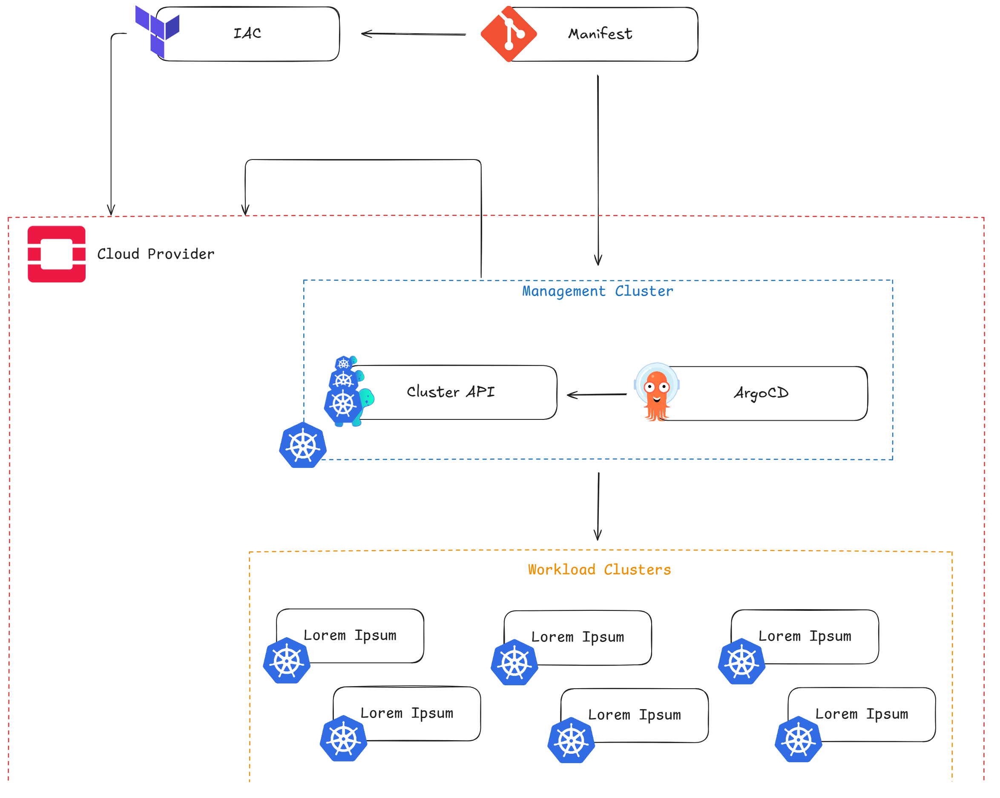
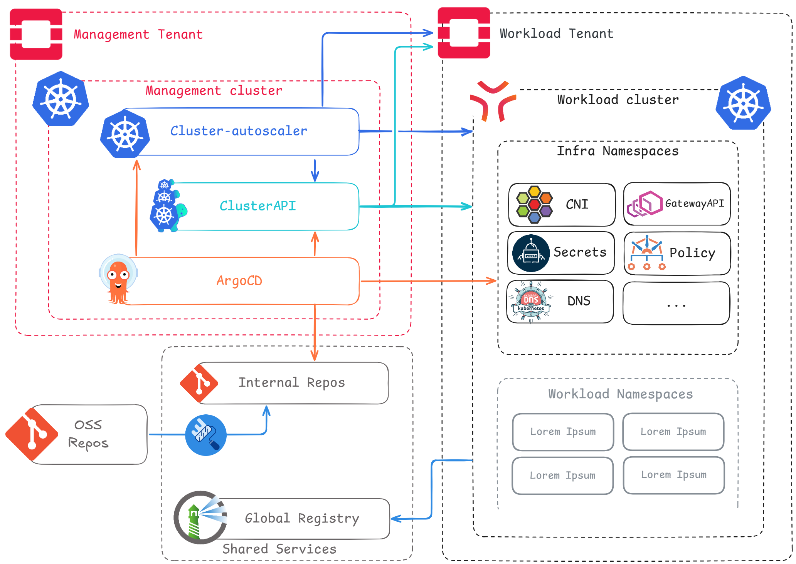

## Relevant projects


  
  
  - **Using since:** 2024
  - **Current version:** v3.3.6

  ArgoCD is used here as our main infrastructure engine. We've configured it so it can manage Day 1 and Day 2 operations seamlessly: Cluster APIs primitives on the management cluster to manage control plane operations, and helm applications to manage tooling and configuration of workload clusters. This infrastructure ArgoCD is centralized and dedicated to the platform team.
  

  
  
  - **Using since:** 2024
  - **Current version:** v1.10.5

  Cluster API manages K8s control planes & machines at scale leaning on the ad hoc infrastucture providers (CAPO for OpenStack. CABPT and CACPPT for Talos), and serves as autoscaling & autohealing provider.
  

  
  
  - **Using since:** 2021
  - **Current version:** v2.0.1

  External-dns automates Designate DNS records management for workload Clusters.
  

  
  
  - **Using since:** 2022
  - **Current version:** v1.3.2

  External Secrets Operator is the glue between Hashicorp Vault and workload clusters, allowing for secure and centralized secrets management.
  

  
  
  - **Using since:** 2021
  - **Current version:** v2.14

  Harbor is the centralized registry: storing and distributing every image used on any container based infrastructure at SNCF.
  

  
  
  - **Using since:** 2018
  - **Current version:** v1.35

  SNCF's sole container orchestrator. Used across all hosting zones, including critical infrastructure like high-speed trains.
  

  
  
  - **Using since:** 2024
  - **Current version:** Yoga

  OpenStack provides Machines, DNS, Storage and Network to the platform, it is fully automated by CAPO and therefore abstracted from App Teams.
  

  
  
  - **Using since:** 2024
  - **Current version:** v43

  Renovate helps us automate OS and dependency patch management.
  

  
  
  - **Using since:** 2024
  - **Current version:** v1.13.2

  Talos Linux provides an immutable OS and Kubernetes distribution combo.
  


## TLDR; Synopsis

This reference architecture describes SNCF's second generation On-Premise Kubernetes Platform, built upon a bare-metal, open source OpenStack Infrastructure to provide at scale Container orchestration and scheduling.
It has revolutionized hosting options for the organization's applications, successfully providing a public cloud-managed Kubernetes service equivalent to internal teams. This platform allows them to build a sovereign strategy aligned with application requirements.

In particular, this architecture aims to show:

* How legacy, non-tech organizations can address cloud migration, sovereignty and infrastructure automation in real life.
* How to design a Managed Kubernetes Service using a 100 % open-source with zero vendor lock-in approach.
* How the proposed architecture is designed for end-to-end automation for all its components.

## Organization

SNCF is the publicly owned French rail operator, in charge of every layer of the rail transportation system except actually building trains. It encompasses thousands of different trades, resulting in needing thousands of different software applications operated mostly by one IT department.

The company decided in the late 2010s to move massively to the public cloud, giving birth to a containers platform team leaning on public cloud-managed Kubernetes services to create a hosting solution for container compatible applications.
In 2023, that massive public cloud move was mainly wrapped up, the Kubernetes platform entering a growth sustainability phase, with at scale management problematics enforcing GitOps adoption. These stabilization efforts soon highlighted the need to offer the same level of service for container compatible applications not eligible for public cloud migrations, in order to prevent the organization to risk vendor lock-in with a fragmented two-tier system.

This was addressed by a joined initiative between a private cloud provider built on premises and an end-to-end automated kubernetes platform build on top of it.

## Teams

* **Private Cloud Infrastructure** is in charge of OpenStack deployment and configuration, managing hardware and network across SNCF's private hosting zones owned by the SNCF. They offer virtualization, storage, network, LB on which our Kubernetes platform is built.
* **Cloud Native Integration** builds, deploys, and maintains Kubernetes platforms on various hosting zones. We manage infrastructure, tooling and common services integration Apps Teams to deploy their software the easiest and best way possible.
* **Apps Teams** develop, build, and ship applications anywhere in SNCF's numerous hosting zones.

## Architecture

The architecture described below, is our OnPremise implementation of our Kubernetes deployment strategy.

### Goals

- A unified and streamlined way to deploy and maintain Kubernetes across all our landing zones (private and public clouds).
- A centralized end-to-end cluster and tooling lifecycle management.
- Security and compliance policies enforcement across all clusters.
- A large number of clusters manageable by a small infrastructure team.
- Deploying new clusters in minutes.
- A maintainable architecture.
- 100 % open-source.

## Can you expand on why you are using those projects/services?

CNCF projects and OpenSource are at the heart of our architecture:
- **ClusterAPI - Clusters and Machines Management** *(adopted in 2025)*: ClusterAPI uses CAPO for lifecycle management of our Kubernetes clusters' control plane. It also provides through CACPPT machine configuration, enabling node autoscaling and autohealing thanks to cluster autoscaler.
- **Talos - OS/Kubernetes Combo** *(Kubernetes: adopted in 2018, Talos: adopted in 2025)*: We use Kubernetes on every SNCF hosting zone. Talos was chosen as "Kubernetes Operating System" because it is an streamlined way to deploy production-grade clusters with immutability and security in mind. We manage Talos nodes through the Cluster API's Talos provider (CACPPT).
- **Openstack - Infrastructure provider** *(adopted in 2025)*: OpenStack allow us to consume the bare-metal infrastructure in a cloud native way. It gives us a similar resource abstraction for infrastructure as public clouds. We consume OpenStack through the Cluster API's Openstack provider (CAPO).
- **ArgoCD - Clusters and tooling source of truth** *(adopted in 2023)*: We are using ArgoCD on all our clusters on private and public clouds. It allows us to manage the lifecycle of clusters infrastructure components.
- **Kyverno - Policy enforcer and resource mutation** *(adopted in 2022)*: Admission policies allows us to enforce compliance with the organization's policy (e.g., images coming from our private registry, specifying requests/limits). We also leverage resource mutation capabilities to simplify workload best practices for apps teams without having to develop a dedicated controller or operator (e.g., automaticaly configure pod disruption budgets or topology spread constraints).
- **Cilium - CNI**  *(adopted in 2023)*: We use Cilium as CNI on all our infrastructures. We especially use it for its network policies capabilities. We may use it for cluster mesh in the future.
- **Harbor - Private registry** *(adopted in 2020)*: Harbor is our private registry used to store OCI artifacts (like images, charts, etc.).
- **Renovate - Automatic Patch Management** *(adopted in 2025)*: Renovate is used to automate patch management for Talos, Kubernetes, and infrastructure components.

## What has worked well?

The combination of OpenStack + Kubernetes with Talos + ClusterAPI + ArgoCD allows us to easily build clusters on our on-premise datacenters, and enables cluster provisioning for users in minutes.
They provide cloud-native capabilities on-prem, like: resilience, auto-scaling, on-demand load balancing and storage, easy upgrades, etc.

## What needs improvement?

The main challenge lies with Cluster API Talos providers, which do not always keep pace with CAPI core releases.
This prevents us from upgrading CAPI core to the latest version.
We plan to invest engineering time in upstream contributions to the project.

## What sort of “glue” have you had to develop to enable usage of your architecture ?

- **Capix**: a controller linking cluster creation by ClusterAPI with the deployment of Kubernetes manifests via ArgoCD. 
  It basically shares the newly generated kubeconfig from ClusterAPI with ArgoCD to deploy day2 manifests on the cluster.

- **GoIDC**: is an OIDC authentication CLI for our on-premises clusters. It allows users to authenticate to their clusters using their corporate credentials.

- **get-onprem-cluster**: is our CLI for users to easily download their kubeconfigs.

## Has your architecture evolved? What lessons have you learned from previous iterations?

First iteration: This version started with Terraform, OpenStack, and Talos Linux, but we identified gaps in Day 2 operations efficiency.

Second iteration: We added GitOps using ArgoCD, leveraging the work already done for our other Kubernetes stacks. This improved management of CNI, CSI, security, and monitoring features.

Third iteration: We noticed one missing piece: autoscaling, which was not supported by the standard [cluster-autoscaler](https://github.com/kubernetes/autoscaler/tree/master/cluster-autoscaler) on OpenStack. As a result, we migrated to Cluster API, which is fully compatible.

The goal was to enable autoscaling, but Cluster API provides even more features and simplifies our workflow. By adding Helm templating, the solution now offers:

* Cluster provisioning in just a few dozen minutes.
* Native autoscaling capabilities.
* Easier node swapping and replacement.
* Full cluster upgrades (Kubernetes and/or OS versions) in about 15 minutes.

However, it required significant custom integration work and we encountered several pain points when using the [cluster-api-control-plane-provider-talos](https://github.com/siderolabs/cluster-api-control-plane-provider-talos/) and [cluster-api-bootstrap-provider-talos](https://github.com/siderolabs/cluster-api-bootstrap-provider-talos).

Indeed, we had to invest in these two projects because keeping them up to date with the Cluster API core depends heavily on community efforts.

## What’s next for your architecture? What are you looking to do next?

We currently offer single-AZ clusters, as the underlying OpenStack platform operates within one availability zone. 
We're working with the OpenStack platform team on a multi-AZ OpenStack deployment to enable multi-AZ cluster support.

## Discussion

End user members may participate in the [discussion thread](https://github.com/cncf/enduser-private/discussions/TBD) for this architecture.
