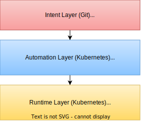

## Relevant Projects

### CNCF Projects


  
  [](https://www.cncf.io/projects/kubernetes/)

- **Using since:** 2021

  The Kubernetes API is the database backend and control plane of the entire automation platform. It acts as the runtime for all CNFs, operators, and platform services. Custom Resource Definitions extend the API to cover telco-specific concerns like IPAM, DNS, and network function configuration.
  

  
  [](https://www.cncf.io/projects/flux/)

- **Using since:** 2022

  Flux is the GitOps engine for continuous reconciliation. It monitors Git repositories and synchronizes all desired state — CNF deployment manifests, Custom Resources, DNS endpoints, certificate requests, IP claims, and test definitions — into Kubernetes clusters.
  

  
  [](https://www.cncf.io/projects/cert-manager/)

- **Using since:** 2023

  Automated certificate lifecycle management integrated with Swisscom's internal PKI. Certificate requests are expressed as Kubernetes CRs, reconciled by Flux, and managed by cert-manager. Private keys never leave the cluster.
  

  
  [](https://www.cncf.io/projects/headlamp/)

- **Using since:** 2025

  Kubernetes dashboard for the management cluster, providing cluster visibility, RBAC-based access control, a CRD documentation browser, and extensible plugin system. Swisscom is listed as an official Headlamp adopter.
  

  
  [](https://docs.sdcio.dev/)

- **Using since:** 2024

  Used as the Config Sync Operator to push assembled configurations to CNFs. SDC enables vendor-agnostic, declarative configuration management using YANG schemas and NETCONF/gNMI protocols. Swisscom adopted SDC as its strategic configuration management solution and actively contributes features including config blame, drift detection, validation, testing compatibility with CNFs, and NETCONF Actions support. Swisscom is listed as an official SDC adopter.
  

  
  [](https://www.cncf.io/projects/coredns/)

- **Using since:** 2021

  In-cluster DNS service discovery for Kubernetes services. Also used with conditional forwarding to route queries for private 5G zones (e.g., 3gppnetwork.org) to the authoritative PowerDNS servers.
  

  
  [](https://kubernetes-sigs.github.io/external-dns/latest/)

- **Using since:** 2023

  Kubernetes-native automation of DNS records in PowerDNS using Custom Resources and annotations.
  

  
  [](https://www.cncf.io/projects/metallb/)

- **Using since:** 2022

  Load balancer for bare-metal Kubernetes clusters. MetalLB IP address pools are managed via KRM, with IP addresses dynamically allocated from NetBox via the NetBox Operator.
  

  
  [](https://github.com/kubernetes-sigs/kubebuilder)

- **Using since:** 2022

  Scaffolding framework and libraries for building custom Kubernetes operators. Used to build all domain-specific operators for CNF configuration abstraction, IPAM integration, config synchronization, and DNS automation.
  


### Other Projects


  
  [](https://www.powerdns.com)

- **Using since:** 2023

  Authoritative DNS server supporting automation of advanced resource records (NAPTR, SRV) required for 5G/SIP via ExternalDNS.
  

  
  [](https://github.com/netbox-community/netbox-operator)

- **Using since:** 2024

  Kubernetes operator for IPAM integration, open-sourced by Swisscom. Brings IPAM into the Kubernetes API with a claim model inspired by PersistentVolumeClaims — dynamically allocating IP prefixes and addresses from NetBox, managing their lifecycle through Kubernetes garbage collection, and supporting sticky IPs for disaster recovery.
  

  
  [](https://github.com/netbox-community/netbox)

- **Using since:** 2023

  IP Address Management (IPAM) and network infrastructure modeling. Used as the IPAM backend for dynamic IP allocation across all CNFs and platform services.
  


## TL;DR or Synopsis

Swisscom has built a cloud native telco platform for the end-to-end automation of its 5G standalone core network and cross-domain resource orchestration. The architecture replaces traditional imperative network management (Jenkins pipelines, Ansible playbooks) with a fully declarative, Kubernetes-native automation model driven by GitOps and the Kubernetes Resource Model (KRM).

A mobile core development environment contains approximately 2,000 pods with over 5,000 interdependent configuration parameters across Cloud-Native Network Functions (CNFs) such as UPF, SMF, AMF, UDM, UDR, BSF, NRF, NSSF, and AUSF. Engineers express high-level intents as Kubernetes Custom Resources; custom operators dynamically assemble full configurations at runtime — fetching IP addresses from IPAM, secrets from Vault, certificates from PKI, and infrastructure details from the cluster.

While the 5G core is the primary domain, the orchestration framework extends across multiple network domains and infrastructure services, applying the same intent-based automation patterns consistently.

## Organisation

Swisscom is the leading Telecommunications/ISP and ICT company and offers mobile, Internet and TV products, as well as comprehensive IT and digital services to private and business customers.
Swisscom's expertise in cloud native technologies is well-established, as evidenced by its status as a former Gold member and Management Board member of the Cloud Foundry Foundation, along with its certification for Cloud Foundry.
Additionally, Swisscom demonstrates a strong commitment to the Open-Source community, having been a CNCF Silver Member for several years and serving as a Kubernetes Certified Service Provider (KCSP) partner.
Our skilled employees have delivered numerous talks and presentations at prestigious events such as KubeCon, Cloud Native Zürich, Swiss Cloud Native Day, KCD Suisse Romande, ContainerDays.

The company has embarked on a strategic transformation from a traditional telecom operator ("Telco") to a technology company ("TechCo") with 5G as a central driver.
Swisscom operates an extensive 5G Non-Standalone (NSA) network covering 99% of the Swiss population. The cloud native platform described here powers the 5G Standalone (SA) core.

## Teams

Multiple teams collaborate on this platform:

- **Cloud Native Resource Orchestration** — creates a robust framework for orchestrating cloud-native resources such as CNFs, IPAM, Networks, DNS, Kubernetes Clusters, and more. Designs and operates GitOps pipelines, builds Kubernetes operators, and develops the management cluster UI/UX.
- **Mobile Cloud Native Engineering** — designs, implements, and operates the cloud native 5G core platform, including GitOps pipelines, Kubernetes operators, and network function lifecycle management.
- **DNS Engineering** — builds and operates the highly reliable cloud native DNS service underpinning the 5G core and other infrastructures.
- **Network Engineering** — provides IPAM and Network-as-a-Service.
- **Platform & Developer Experience** — manages Kubernetes clusters and builds developer tooling.

## Architecture overview & Goals

### Goals

1. **Full GitOps for the 5G Core** — Extend GitOps beyond CNF deployment to include network function configuration, certificate management, DNS record provisioning, IP address management, and testing — achieving continuous reconciliation across all layers.
2. **Declarative, Intent-Based Configuration** — Replace static, low-level configuration manifests with abstract, intent-driven Custom Resources. Engineers specify *what* they want using a high level intent (e.g., "this CNF needs an IP address from a subnet in network zone A") rather than *how* to achieve it, with Kubernetes operators dynamically assembling configurations at runtime.
3. **Automated CD** — High level of automation for telco deployment rollouts. This includes rethinking Change Processes as well as building solid CI/CD/CT pipelines to ensure a highly reliable network.
4. **In-Band with Kubernetes** — Bring all automation in-band with the Kubernetes API, eliminating out-of-band tools like Jenkins pipelines and Ansible playbooks. This ensures that the Kubernetes orchestrator has full visibility and control over all resources, enabling self-healing and reconciliation.
5. **Cloud Native DNS Service** — Operate a highly reliable, geo-redundant, on-premises DNS service for the 5G core using open-source technologies (CoreDNS, PowerDNS, ExternalDNS), fully automated via GitOps and Kubernetes Custom Resources.
6. **Contribute to the Ecosystem and Shape the Industry Discussion** — Open-source key components built or contributed to during this journey (NetBox Operator, SDC, demo code) to enable other organizations to adopt similar patterns. Contribute to Meetups and Conferences in order to achieve broader success of Cloud Native adoption in the Telco Community.

### Architecture overview

The platform is organized in three layers:



The **Intent Layer** stores high-level desired state in Git — engineers define *what* they want using concise Custom Resources (e.g., a DNN configuration with hostname, region, and SNSSAI).

The **Automation Layer** runs on Kubernetes and continuously reconciles. Flux pulls intents from Git. Custom operators dynamically assemble full configurations by fetching IP addresses from NetBox (via the NetBox Operator) and creating connectivity in a Network-as-a-Service platform. It then pushes the KRM formatted Runtime Configuration to a Git repository for the Runtime layer to consume.

The **Runtime Layer** hosts the 5G core CNFs and supporting services. Flux pulls intents from Git. SDC pushes the assembled configuration to CNFs via NETCONF/gNMI. MetalLB, cert-manager, External Secrets Operator, ExternalDNS are used to configure the Workload cluster.


### Key Design Principles

- **GitOps + KRM**: Git stores high-level intents; Kubernetes manages dynamic, low-level configuration assembly. This is a shared source of truth across Git and Kubernetes.
- **Continuous Reconciliation**: Every aspect of the system is continuously reconciled against the desired state — following the four OpenGitOps principles.
- **Abstraction over Complexity**: Engineers work with simple, high-level intents; operators handle the complex assembly.

## Can you expand on why you are using those projects/services?

### From GitOps to KRM

Standard GitOps tools (Flux, Argo CD) combined with Helm/Kustomize have limitations for complex telco use cases: they cannot use live Kubernetes resources as inputs during rendering, cannot invoke custom business logic during template processing, and cannot dynamically assemble configurations from multiple sources. By extending GitOps with the Kubernetes Resource Model (KRM) — Custom Resource Definitions, Custom Resources, and custom Operators — the platform achieves dynamic configuration assembly at runtime.

### Configuration Abstraction & Dynamic Assembly

A typical 5G core configuration includes IP addresses, VLAN IDs, DNS records, NF variables, secret references, and certificate references. Previously, engineers had to know all values upfront and embed them statically. The new intent-based model inverts this. The following is an example of a DNN configuration in pseudo-yaml-code.

On the intent layer, only a very stripped-down KRM manifest exists:

```yaml
apiVersion: telco.swisscom.com/v1
kind: Dnn
spec:
  hostname: "gprs.swisscom.com"
  ipv4: true
  region: ch-east
  type: MobileInternet
  snssai: [1, 10]
```

This KRM manifest is stored in git and synced to the Management cluster using Flux. From this, the Operators in the automation layer create intermediate resources, in this case an IP Address via NetBox:

```yaml
apiVersion: netbox.dev/v1
kind: IpAddressClaim
spec:
  parentPrefixSelector:
    region: "ch-east"  # from Dnn.spec.region
    family: "IPv4"  # from Dnn.spec.ipv4
status:
  ipAddress: 1.2.3.4
```

The Automation Layer creates the following low level resources for the Runtime Layer:

```yaml
apiVersion: config.sdcio.dev/v1alpha1
kind: Config
metadata:
  labels:
    config.sdcio.dev/targetName: ch-east  # from Dnn.spec.region
    config.sdcio.dev/targetNamespace: default
spec:
  priority: 10
  config:
  - path: /
    value:
      dnn:
      - name: "gprs.swisscom.com"  # from Dnn.spec.hostname
        ip: 1.2.3.4  # from IpAddressClaim.status.ipAddress
        snssai: [1, 10]  # from Dnn.spec.snssai
        type: MobileInternet  # from Dnn.spec.type
---
apiVersion: externaldns.k8s.io/v1alpha1
kind: DNSEndpoint
spec:
  endpoints:
    - dnsName: "gprs.swisscom.com"  # from Dnn.spec.hostname
      recordType: A
      targets:
        - 1.2.3.4  # from IpAddressClaim.status.ipAddress
```

SDC will now sync the configuration to the 5G CNF and ExternalDNS will create the DNS records in the authoritative PowerDNS backend.

## What has worked well?

- **Intent-based configuration** dramatically reduced the complexity engineers face. Instead of managing thousands of interdependent parameters, they work with concise Custom Resources.
- **Full GitOps reconciliation** across all layers (deployment, configuration, DNS, certificates, IPAM), configuration drift is detected and reverted to ensure consistency.
- **Custom Kubernetes Operators** (built with Kubebuilder/controller-runtime) proved to be the right pattern for telco domain-specific concerns, providing full reconciliation support and native KRM integration.
- **The claim model for IPAM** (NetBox Operator) elegantly solved dynamic IP allocation by following established Kubernetes patterns (PVC analogy).
- **Bringing all automation in-band with Kubernetes** gave the orchestrator full visibility and control, enabling self-healing and eliminating the brittleness of out-of-band tools.
- **DNS resilience engineering** — dedicated hackathons, chaos testing, and disaster recovery playbooks significantly improved DNS service reliability.
- **Cross-team collaboration** on a shared platform and KRM patterns accelerated adoption across multiple network domains.

## What has not worked well?

- **NETCONF as a configuration protocol** introduces complexity — it requires SDC as an intermediary and prevents fully Kubernetes-native configuration. Ideally, CNF vendors would support native K8s APIs using CRs/CRDs or Secrets/ConfigMaps.
- **Tooling gap for KRM-based configuration assembly** — no mature, community-standard Kubernetes-native tool exists for dynamic configuration hydration. Swisscom had to build custom operators to fill this gap.
- **GitOps+KRM auditability trade-off** — with dynamically assembled configurations, not all state is visible in Git history. The team continues to explore automated intermediary Git layers.
- **Cumbersome vendor configuration manifests** — large, monolithic configuration files from CNF vendors (with ~5,000 interdependent parameters) required significant effort to decompose into intent-based abstractions.
- **Telco YANG and Kubernetes YAML lack feature parity** — SDC is based on KRM which is limited to YAML. Mapping YANG to this model is a challenge. For an example, [YANG has ordered lists which YAML doesn't](https://github.com/sdcio/data-server/issues/394).

## What sort of "glue" have you had to develop?

- **Custom Kubernetes Operators** — domain-specific operators for CNF configuration abstraction, config synchronization, IPAM integration, and DNS automation, all scaffolded with Kubebuilder and controller-runtime.
- **Configuration hydration logic** — the CNF Config Operator dynamically assembles full configurations from multiple sources (NetBox, Vault, cluster environment) based on high-level intents.
- **SDC contributions** — [significant development work on SDC](https://github.com/search?q=org%3Asdcio+author%3Aalexandernorth&type=pullrequests) including early testing of CNF compatibility, configuration validation, monitoring, config blame, drift detection, and NETCONF Actions support.
- **ExternalDNS NAPTR support** — contributed [PR #4212](https://github.com/kubernetes-sigs/external-dns/pull/4212) to enable NAPTR record support for SIP phone calls.
- **Resilient DNS architecture** — created a reference architecture and open sourced on [GitHub](https://github.com/swisscom/cloud-native-telco/tree/main/prototypes/dns).
- **Headlamp plugins** — [Custom Resource plugin](https://github.com/kubernetes-sigs/headlamp/pulls?q=is%3Apr+author%3Afaebr+).

## How did the Architecture Evolve

### Journey

The architecture evolved significantly from traditional imperative automation to the current declarative, KRM-based model:

1. **Phase 1 — Ansible + Jenkins**: Initial automation used Ansible playbooks triggered by Jenkins pipelines. Configuration was fire-and-forget with no continuous reconciliation.
2. **Phase 2 — GitOps for deployment**: Introduced Flux for CNF deployment, but configuration remained out-of-band via Ansible/NETCONF.
3. **Phase 3 — Full GitOps + KRM**: Extended GitOps to cover configuration, DNS, IPAM, certificates, and testing. Built custom operators and adopted SDC for config synchronization. Achieved continuous reconciliation across all layers.

### Key lessons

- **De facto GitOps for operators is not true GitOps** — creating Helm releases in Git while configuring NFs via NETCONF out-of-band breaks the GitOps model. Bringing configuration into the Kubernetes API was essential.
- **Bringing everything in-band with Kubernetes** enables self-healing, reconciliation, and eliminates the brittleness of out-of-band tools.
- **Git as the *only* source of truth is insufficient** — the shared source of truth model (Git for intents, Kubernetes for dynamic state) was a deliberate and necessary evolution.
- **Abstraction is critical** — engineers cannot effectively manage 5,000+ parameters directly. Intent-based CRs with dynamic assembly significantly reduced cognitive load and errors.
- **Custom Kubernetes Operators** are the right pattern for domain-specific concerns that existing tools cannot address.
- **Contribute upstream** — local patches create long-term maintenance burden. Swisscom prioritizes upstream contributions (ExternalDNS, SDC, NetBox Operator) for sustainability.

### What's next for your architecture?

- **Mature SDC Integration** — Continue expanding SDC for full lifecycle management with continuous reconciliation via gNMI and NETCONF, including completion of NETCONF Actions support.
- **Eliminate NETCONF Dependency** — Work with CNF vendors to move toward fully Kubernetes-native configuration APIs, reducing reliance on legacy telco protocols.
- **Advanced Dynamic Configuration Assembly** — Develop more sophisticated Kubernetes operators for multi-source configuration hydration, enabling even more complex intent-based workflows across multiple network domains.
- **Multi-Cluster & Edge Expansion** — Scale the architecture to additional edge locations and Kubernetes clusters while maintaining consistent GitOps-driven automation.
- **Community Tooling for KRM** — Contribute toward a mature, Kubernetes-native tool for dynamic configuration assembly that the wider cloud native community can adopt, addressing the current gap in tooling identified during the project.
- **Resilience & Reliability** — Ongoing improvements to cross-cluster redundancy, disaster recovery playbooks, chaos testing framework, and enhanced monitoring/alerting.
- **Observability & AIOps** — Integrate AI-driven operations capabilities leveraging the rich telemetry data from the platform's monitoring stack.
- **Cross-Domain Expansion** — Extend the orchestration framework to additional network domains and infrastructure services beyond the 5G core, applying the same intent-based automation patterns consistently.

## Community Contributions

| Contribution | Details |
| ------------ | ------- |
| **NetBox Operator** | Open-sourced under [https://github.com/netbox-community/netbox-operator](https://github.com/netbox-community/netbox-operator) |
| **SDC Contributions** | Active contributor to the [SDC project](https://docs.sdcio.dev/) (on its path to CNCF incubation) |
| **KRM Demo Code** | [https://github.com/swisscom/containerdays-2024-krm](https://github.com/swisscom/containerdays-2024-krm) |
| **Conference Talks** | [KubeCon EU, ContainerDays, Open Source Summit EU](https://github.com/swisscom/cloud-native-telco/) |
| **CNCF/LFN Whitepaper** | Co-authored [Accelerating Cloud Native in Telco](https://github.com/lfn-cnti/bestpractices/blob/main/doc/whitepaper/Accelerating_Cloud_Native_in_Telco.md) |

## Discussion

End user members may participate in the [discussion thread](https://github.com/cncf/enduser-private/discussions/85) for this architecture.
