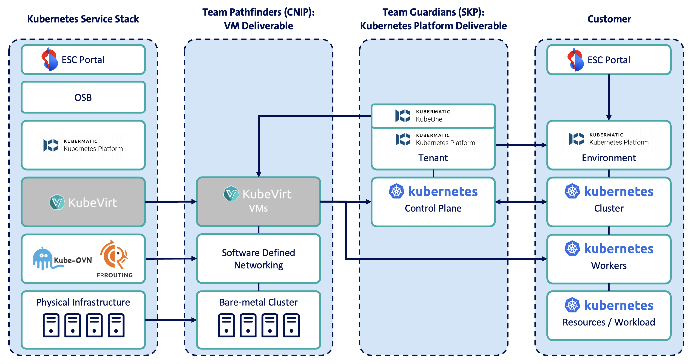
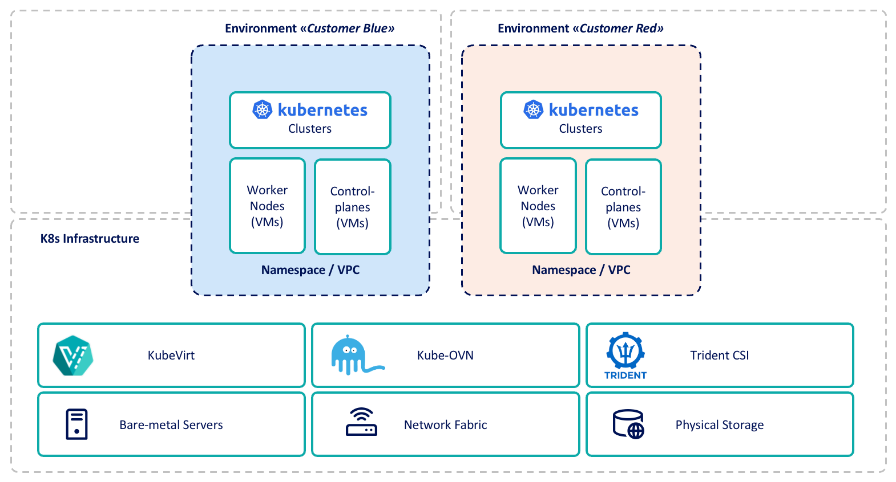
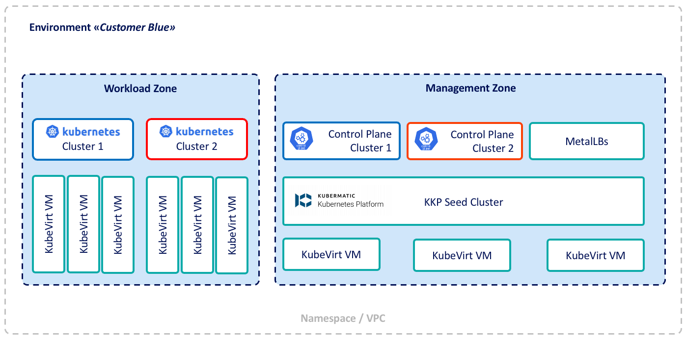
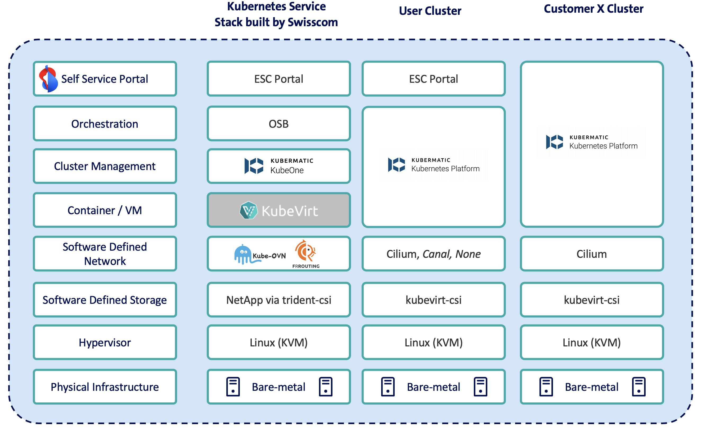

## Relevant CNCF projects


  
  
  - **Using since:** 2024
  - **Current version:** 1.32.8 (CNIP)
  - **Current version:** 1.31.x - 1.34.x (SKP)

  Kubernetes enables high availability, scalability, and performance for infrastructure, offering a centralized and policy-driven platform to manage network and service data supporting Managed Kubernetes for our cloud customers.
  

  
  
  - **Using since:** 2024
  - **Current version:** v1.5.0 (CNIP)

  Cluster resources are constructed using KubeVirt for virtual machine abstraction of Control Plane and Worker instances.
  

  
  
  - **Using since:** 2024
  - **Current version:** v1.13.14 (CNIP)

  Kube-OVN is utilized as network stack of the infrastructure cluster to enable intra-cluster/east-west network communication of user clusters. It enables a policy-driven security model as well as customer network isolation using VPCs.
  

  
  
  - **Using since:** 2024
  - **Current version:** v0.15.3

  MetalLB is an integral component of the infrastructure deployment process, offering automated access to the framework that provisions individual user cluster resources on bare metal Kubernetes environments.
  

  
  
  - **Using since:** 2024
  - **Current version:** v25.06.3 (trident-csi)
  - **Current version:** v0.4.5 (kubevirt-csi)

  Kubevirt-CSI is the standard storage interface for persistent volumes in user clusters. Trident-CSI manages NetApp storage requests and can also be used directly to integrate with Swisscom's File Service Kubernetes, which provides iSCSI and NFS shared storage across all Availability Zones.
  

  
  
  - **Using since:** 2024
  - **Current version:** v1.13.4 (CNIP)

  Kyverno serves as the default policy engine for infrastructure and user clusters, providing robust security constraints.
  In addition to Kyverno, also Chainsaw (a Kyverno sub-project) is used for automated, declarative e2e testing.
  

  
  
  - **Using since:** 2024
  - **Current version:** v3.2.0 (CNIP)

  ArgoCD allows us to deliver comprehensive infrastructure using a fully automated GitOps methodology.  
  

  
  
  - **Using since:** 2024
  - **Current version:** v3.5.1 (CNIP)

  Helm automates the creation, packaging, configuration, and deployment of Kubernetes applications by creating reusable charts.  
  

  
 
  - **Using since:** 2024
  - **Current version:** v1.27.0 (CNIP)

CloudNativePG (CNPG) manages PostgreSQL databases in cloud-native environments. It handles the full lifecycle of highly available PostgreSQL clusters (primary/standby with native streaming replication), including declarative deployment, scaling, backups, self-healing, failover and monitoring.  
  



## Describe your organisation
Swisscom is the leading ICT company in Switzerland and offers mobile, Internet and TV, as well as comprehensive IT and digital services to private and business customers.
Swisscom's expertise in cloud native technologies is well-established, as evidenced by its status as a former Gold member and Management Board member of the Cloud Foundry Foundation, along with its certification for Cloud Foundry. 
Additionally, Swisscom demonstrates a strong commitment to the Open-Source community, having been a CNCF Silver Member for several years and serving as a Kubernetes Certified Service Provider (KCSP) partner. 
Our skilled employees have delivered numerous speeches and presentations at prestigious events such as KubeCon, Cloud Native Zürich, Swiss Cloud Native Day, KCD Suisse Romande, ContainerDays, among others.

Our next generation Private Cloud Container as a Service offering «Kubernetes Service» for the B2B market addresses customer’s need for scalable and highly available Kubernetes workload as a flexible and secure IT foundation.
It is part of our Swiss-based Enterprise Service Cloud (ESC) market channel as a sovereign, Private Cloud Kubernetes offering for effortless provisioning and usage of our customer’s container workloads. 

## Describe your entity and/or team
The development and delivery of the new «Kubernetes Service» is done at within Swisscom's IT-Clouds Value Stream and shared across two teams:
  - Pathfinders: responsible for the Cloud Native Infrastructure Platform (CNIP). 
  CNIP handles the creation, delivery, and lifecycle management of the KubeVirt-based virtual machines (VMs). These VMs function as nodes for both the Control Plane and Workers. The VMs are ephemeral and can be re-created immediately in case of any failure. They are solely used to enable container-based workloads and do not act as standalone VMs.
  - Guardians: responsible for the Swisscom Kubernetes Platform (SKP), which runs on top of CNIP.
  It consists of the installation of Kubermatic Kubernetes Platform (KKP) for the customer tenant (environment) and the setup and support of the highly available Control Plane for any customer (user) cluster.

The layered approach allows Swisscom to manage technological aspects distinctly by segregating the cloud native infrastructure (managed by the Pathfinders team) from the Kubernetes platform (managed by the Guardians team). 
This strategy ensures considerable flexibility, permitting each layer to be combined or integrated with other technologies in the future.

## Brief overview of your architecture and any potential goals you are trying to achieve with it?

### Summary
Kubernetes Service is the successor to our current container offering, representing a significant shift towards a more cloud-native approach using advanced Open-Source technology.
Currently bound to a vendor-specific implementation, Swisscom has opted to employ open-source tools for the development of cloud native products for customer use. This strategy aims to minimize dependencies and mitigate the risk of vendor lock-ins.

By adopting this architecture, Swisscom can uphold quality within the cloud native domain while maintaining a competitive pricing model due to reduced reliance on external licensing and subscription models.
Furthermore, having the ability to develop, maintain, and operate all components internally enhances our decision-making processes and strengthens our roadmap capabilities.  

Another important point is that our customers' data will always remain within Switzerland and under Swiss law. Since we fully own the platform and do not rely on any external vendors, we can confidently guarantee true data sovereignty, hosted entirely on our premises without relying on vague marketing claims. Additionally, because Swisscom is not subject to the US Cloud Act or similar foreign regulations, no non-Swiss legislation can access the data.

### Brief overview of architecture
A simplified high-level diagram describes Kubernetes Service, including multi-tenancy and security aspects:

As illustrated in the figure, two separate and independent user tenants, BLUE and RED, are established on shared resources (depicted in yellow), managed by the Kubernetes Infrastructure Cluster. The foundation for all virtual abstractions is the Consolidated Infrastructure (COI) in Swisscom’s data centers.

Each customer-specific environment comprises a management zone (MGMT Zone) and a workload zone.
These zones address shared responsibilities, where Swisscom provides the Control Plane for each customer's environment (illustrated in blue and orange in the next figure).  

Customers have the flexibility to deploy workloads within the workload zone independently of the management resources as required.
Furthermore, each customer is able to maintain multiple environments. This provides an alternative method for segregating workloads at the tenant level instead of the Kubernetes cluster level, thereby ensuring comprehensive isolation from the outset.

### Goals and objectives

One of the primary objectives of the product refresh is to offer more desired features to customers.
Compared to the current offering, enhancements include:
  - Upstream Kubernetes versions with faster updates
  - Node Autoscaling
  - Integrated Backup functionalities
  - Native Kubernetes Load Balancer
  - Modern customer self-service portal
  - Additional Kubernetes add-ons available via Application Catalog

Moreover, additional options are directly available to our customers:
  - Choose from different Container Network Interfaces (CNI)
  - Access persistent storage through kubevirt-csi

With KubeVirt providing abstraction, KVM is employed as the hypervisor on bare-metal servers. From the customer's perspective (Customer X), the administrator of their user cluster manages all selections and abstractions shown in the figure below, enabling customers to make independent decisions, e.g. choosing a default CNI from the available options (Cilium, Canal, None).

In addition to technical improvements, we aimed to minimise reliance on external vendors and build a truly sovereign cloud solution that can compete with Public Cloud offerings, free from outside service dependencies. Our goal is for customers to run their Kubernetes workloads in our sovereign ESC Cloud, providing a comprehensive alternative to US hyperscalers - in terms of functionality and, most importantly, data privacy.

## Can you expand on why you are using those projects/services?

- **Cloud-Native Implementation**:
  Utilized CNCF projects and technologies to deploy a comprehensive stack consistent with a microservices-based architecture, resulting in enhanced scalability and operational agility.
- **Kubernetes for Orchestration**:
  Adopted Kubernetes to manage containerized workloads, enabling automated deployment, scaling, and resilience on management as well as user cluster level.
- **Kube-OVN as network layer**:
  With Kube-OVN as CNI on the infrastructure clusters and it's VPC functionality, it allows customer environments to be fully segregated on a shared platform, providing maximum flexibility and strong security enforcement. It enables the teams to use familiar cloud-native development, operations, and debugging tools and skills.
- **KubeVirt for VM abstraction**:
  A high-quality, Kubernetes-native virtual machine abstraction facilitates the deployment of container-based resources on a centralized cloud-native infrastructure platform, while maintaining flexibility for future use of VM resources.
- **Open-Source & Cost Efficiency**:
  CNCF components deliver vendor-neutral, cost-effective solutions that are fundamental to container orchestration and observability. These open-source tools form the foundation of our sovereign cloud initiative, empowering internal teams to design customized architectures independently of third-party vendors. Utilizing CNCF technologies allows us to maintain flexibility, scalability, and comprehensive control over our cloud infrastructure, supporting our strategic objectives of autonomy and innovation.
- **Declarative & Configuration-Driven Approach**:
  CNCF tools align with the low-code/no-code principle by enabling declarative configuration management.

## What has worked well?

The implementation has eventually lead to the product launch of Kubernetes Service in August 2025, with some strong outcomes:
 
- **Layered Architecture for Enhanced Robustness**: 
  The integration of Cloud Native Infrastructure Platform (CNIP) and Swisscom Kubernetes Platform (SKP) forms the foundation of the new Kubernetes Service, enabling flexible handling as separate platform layers for streamlined future operations.
- **Vendor-Agnostic Production Platform**: 
  By eliminating proprietary technology, a resilient and adaptable foundation has been established to host managed Kubernetes clusters within Swisscom's Private Cloud, ensuring a high degree of flexibility and scalability, as well as privacy.
- **Modern Cloud-Native Foundation**: 
  The implementation of Kubernetes to deliver managed Kubernetes clusters to end customers enables a unified cloud-native stack across all layers of responsibility, promoting consistency and efficiency.
- **Best Practice Design**: 
  Collaborating with Kubermatic, a modern Kubernetes platform was designed, incorporating the latest technologies such as KubeVirt and Kube-OVN, to ensure an enterprise-ready solution for end customers.
- **Operational Excellence**: 
  Equipping teams with essential cloud-native and Kubernetes expertise enhances the attractiveness of Swisscom's tech stack to potential candidates and reinforces the company's commitment to the Open-Source community.
- **Successful Internal Adoption**: 
  The Kubernetes Service was successfully launched as Swisscom's internal Container platform, achieving significant traction with over 60% of workloads migrated within the first 9 months of operation.

## What has not worked well?

While the architecture delivered significant improvements, several challenges emerged during implementation:

- **Enterprise-Readiness of Cloud Native Technologies**: 
  Despite successful scaling in test and internal production environments, many advanced cloud-native technologies faced difficulties when deployed in enterprise-grade settings for end customers (e.g., B2B market). This highlighted the need for further refinement and testing in real-world scenarios.
- **Limited Support and Professional Services**: 
  The availability of professional support, particularly 24/7, for open-source and cloud-native technologies is limited. This poses challenges for enterprises seeking to adopt these technologies and provide services with guaranteed service levels (SLAs).
- **Knowledge Gaps and Skills Requirements**: 
  Adopting new technologies demands specialized knowledge and expertise. In-house engineers required additional training and support to effectively maintain and troubleshoot products built on these technologies.
- **Customer Acceptance and Migration Challenges**: 
  Introducing a new platform based on modern technologies, without a proven track record in enterprise-grade deployments, required significant effort to educate customers, facilitate migration from legacy stacks, and promote the benefits of a sovereign cloud solution. This process demanded substantial resources and support to ensure a smooth transition.

## What sort of “glue” have you had to develop to enable usage of your architecture ?

The reference architecture provides a strong foundation, making it practical and easy to use. The below elements were designed to simplify adoption, improve usability, and ensure seamless interaction across layers acting as the "glue":

- **Unified Abstraction APIs**: Developed APIs (Open Service Broker spec) that hide complexity and provide a consistent interface for orchestration and other consuming Operational Support Systems (OSS).
- **Advanced Routing Functionality**: In order to integrate the customer environments into the Swisscom Core Network (MPLS), we developed and implemented our own concept of edge routers using BGP on FRRouting pods. This custom solution supports NAT, Fail-over (VRRP) as well as north-south firewalling (traffic from/to customer environments). These router pods are managed by an operator and configured with custom resource definitions.
- **Policy Integration Layer**: Built operators to dynamically apply and manage Kyverno policies across different stages without requiring deep technical intervention.
- **Firewall Management**: Implemented operators and API endpoints to allow customers to manage firewall rules on the SDN layer of the KubeVirt infrastructure, via Kube-OVN network policies.
- **Workflow Orchestration Logic**: Developed and implemented the entire platform orchestration logic and automated pipelines from bottom-up.
- **Commandline tooling**: Various commandline tools for human operators to manage and control the entire platform and all parts of it with ease.
- **Testing & Fine-tuning**: With limited experience in large-scale bare-metal Kubernetes deployments, we had to do a lot of testing, validation and fine-tuning. We had to make sure, that the platform scales properly with more workloads being migrated every day.

## Has your architecture evolved? What lessons have you learned from previous iterations?

Our architecture and product have undergone significant evolution through iterative development, driven by customer feedback and emerging requirements.

- **Iterative Development Approach**: 
  We began by establishing foundational layers and meeting the needs of our internal Swisscom customers. Subsequent iterations introduced advanced features for end customers, incorporating feedback from both internal and external stakeholders.
- **Continuous Improvement and Feedback Loop**: 
  Each iteration allowed us to gather valuable insights and add new functionalities, refining our product and enhancing customer satisfaction.
- **Steep Learning Curve and Expertise Development**: 
  As we ramped up the product, our teams faced a significant learning curve, developing essential expertise and professionalizing DevOps processes to ensure seamless operation.
- **Strategic Partnerships and Support**: 
  Our collaboration with Kubermatic enabled us to leverage professional support for key components, including KubeVirt and Kube-OVN, ultimately maturing our production platform and solidifying its readiness for enterprise-grade deployments.

Through this iterative process, we've gained valuable lessons and refined our architecture to better meet the needs of our customers, while developing the expertise and partnerships necessary to drive continued success.

### Outcome
By embracing open-source and cloud native technologies, Swisscom successfully created a sovereign cloud solution, modernizing its container offering while reducing vendor lock-in and providing advanced features to customers. The new «Kubernetes Service» demonstrates the power of cloud native architectures in creating flexible, scalable, and cost-effective solutions for enterprise-grade services, all while ensuring true data sovereignty and regulatory compliance. This approach positions Swisscom as a leader in sovereign cloud solutions, offering Swiss (and European) customers a trusted alternative to global hyperscalers.

## What’s next for your architecture? What are you looking to do next?

Building on the success of our proven reference architecture, which now supports both internal and external customer workloads in production, we're focused on expanding and enhancing our offerings:

- **Hybrid Cloud Expansion and Multi-Cloud Flexibility**: 
  We're working to enable seamless public cloud deployments, complementing our existing Swiss-based data centers and strengthening hybrid cloud use cases.
- **Edge Cloud Support**:
  With cloud sovereignty in mind, we are developing a «Kubernetes Service On-Prem» extension that will deliver the Private Cloud product on a Cloud Edge Stack at customer premises, enabling an autonomous instance of our Kubernetes Service. This is currently in development with an interested customer.
- **GPU-Enabled Workloads and Emerging Technologies**: 
  Next, we'll be integrating GPU support and exploring other emerging technologies to unlock new possibilities for compute-intensive applications.
- **Customer-Driven Features and Enhancements**: 
  We're committed to delivering additional features and functionalities requested by our customers, further enriching our platform and services.
- **Simplified Onboarding and Resource Optimization**: 
  To improve efficiency and resource utilization, we'll be introducing a shared cluster concept, allowing for more flexible and efficient use of our bare-metal infrastructure.
- **Exploring New Use Cases - VM Workloads**: 
  We're also investigating the possibility of hosting classical VM workloads on our Cloud Native Infrastructure Platform (CNIP), expanding the platform's use cases beyond container-based workloads and further increasing its versatility.

By pursuing these initiatives, we aim to continue delivering value to our customers, drive innovation, and grow our architecture and services to meet evolving needs.
