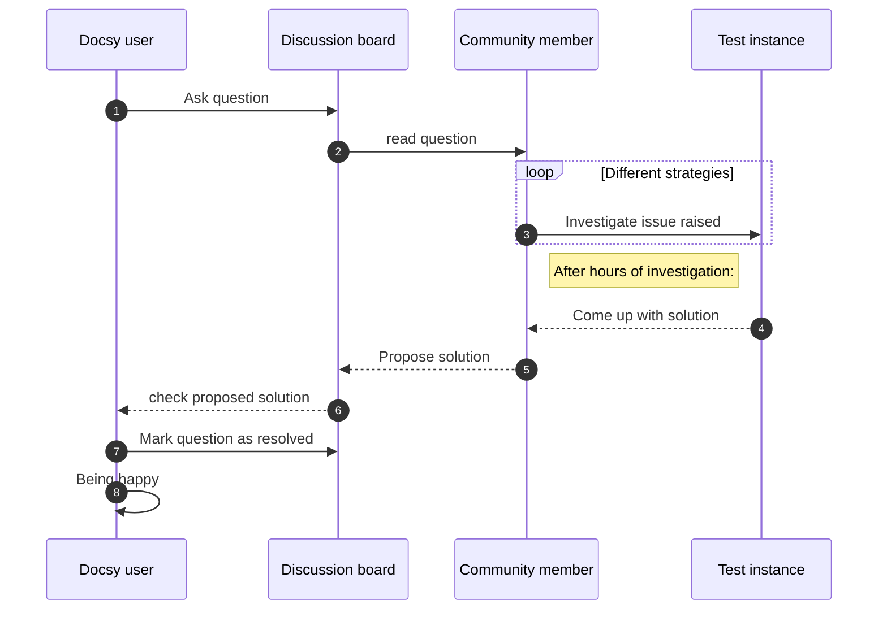

## Relevant CNCF projects


  
  
  - **Using since:** 2016  
  - **Current version:** 1.31  

  Kubernetes has been a staple in our infrastrucutre. We've upgraded in place and have had a minimal amount of issues in the time that we've used it.
  

  
  
  - **Using since:** 2017  
  - **Current version:** v3.14.0 

  Helm works well for what it is. You need to watch how you use it and how you bring in 
  dependencies since sprawl and overly configurable charts can quickly make something that was
  easy to manage, to something very difficult
  

  
  
  - **Using since:** 2016  
  - **Current version:** 1.31  

  Prometheus has been a staple in our infrastrucutre. We've upgraded in place and have had a minimal amount of issues in the time that we've used it.
  


## Describe your organisation 

The University of Michigan is one of the largest public research universities in the United States
with 19 schools and colleges, and over 250 degree programs. It serves roughly 33,000 students
a year, and is supported by 56,000~ staff (includes University of Michigan Hospital).

## Describe your  entity and/or team

The Platform Engineering team is responsible for building a Cloud Native Platform to better serve
in a sustainable way the whole organisation. The team focuses on adopting the best cloud practices
and projects while defining standards and processes for their stakeholders to follow.

## Describe your Platform Engineering Team Topology - internal

The PE team is internally organised in DDOs - Distributed DevOps, where each ddo owns a Domain.
This setup follows the reverse Conway manoeuvre where the reference architecture structure dictates
the teams setup.
The PE team consist of 13 members. All of them internal employees.

The PE team is being supported by auxiliary teams:
Developer Service Hub (DSH): entry level engineers handling the low complexity tasks such as: access management, 
1st level technical support, SRE onboarding, ticket sorting and filtering
Cloud Auditing Hub (CAH): entry level engineers with a focus on compliance and audit
Production Management Hub (PMH): entry level engineers with a focus on incident and problem management
Technical Tribe Leads (TTL): Technical leads on the Tribe (department) level that became our evangelist for best practices and
continuous innovation parteners.

## Describe your Platform Engineering Team Topology - external
Externally, the team has decided to scale by building on the concept of FDOs - Federated DevOps, where 
each squad (developing team) has built internal devops expertise focusing a minimum amount of time on
Operations concerns. A FDO community has flourished and enabled successfully an extremely aggressive organisation scale up
The PE serves an aprox. 500 engineers and 1500 employees.

## Brief overview of your architecture and any potential goals you are trying to achieve with it?

The PE team has built a Cloud Native Platform that serves the core B2C business of a fully digital insurance player acting on
several european markets. It serves also all the newly created B2B business initiatives. 
The highly aggressive scaleup of the both B2B and B2B businesses forced the PE team to redesign the architecture towards 
a multi-tenant architecture with minimum operational effort.
On top, the Platform has become a Organisation Group Standard and an example for Global initiatives. This forced the PE team to
choose a light architecture under a second Platform based on Fargate ECS, reducing the operational effort and talent demand to minimum.

PE team delivered several cloud native best practices:
- gitops (ORGops to be more precise)
- stateless clusters orchestrated by a management cluster 
- Fargate ECS multitenancy 
- devsecops
- SRE

## Can you expand on why you are using those projects/services?

AWS obsession with customers served us well. The technical support and continuous relation with AWS architects
helped us maximise our effectiveness and evolve our architecture as well as complementing our stack with SaaS services
such as EKS, Redis, MSK.

AWS managed Kubernetes gave us the flexibility we needed to meet our users needs with as little overhead as
possible. Most of our application choices come directly from our users, however our
infrastructure choices were made to balance our compliance needs, usability and supportability.

ArgoCD has become instrumental for us and the core of our internal innovation. We are currently using it for spinning
up and managing our multitenant implementation whether that is on namespace level or Fargate ECS level.

PAGT(Prometheus, Alert manager, Grafana and Thanos) stack is the core of our Observability. 
It is complemented by OTEL and ELK Stack and enabled us to build a state of the art SRE journey for all our Stakeholders

## What has worked well?

EKS and now EKS + Fargate ECS works great for us. We can fully owns our core domains and stay hardened with minimum effort.
Complementing our Stack with AWS services especially on Persistence, Data Streaming and Storage increase our innovation speed.
ArgoCD with helm, Atlantis with terraform and Crossplane are working great for us, allowing us to follow the gitops way,
a great way of working for heavily regulated industries.

## What has not worked well?

Service Mesh did not work well for us. The Operational costs and lack of integration on the CNI level made us revert the journey.
Sidecar, eBPF Service Mesh seems to be the way forward for us.

## What sort of "glue" have you had to develop to enable usage of your architecture?
  
  The creation of the Federate DevOps (FDO) and Technical Tribe Leads (TTLs) was essential for our success.
  The first one allowed us to hyper scale the org without scaling the PE team.
  The second allowed us to impact and educate both Engineers and Business.
 
 
## Has your architecture evolved? What lessons did you learn from previous iterations?

The Architecture was designed as a single tenant but due to its success it needed to evolve to support multitenancy on
AWS account level, next on namespace level and now, due to the Global impact, on the Fargate ECS level.

## What's next for your architecture? What are you looking to do next?

Inevitably we ended with three Platforms(Architectures) that need to be simplify towards a maximum two that will evolve rapidly.
Migration work is inevitable.

## Diagram

